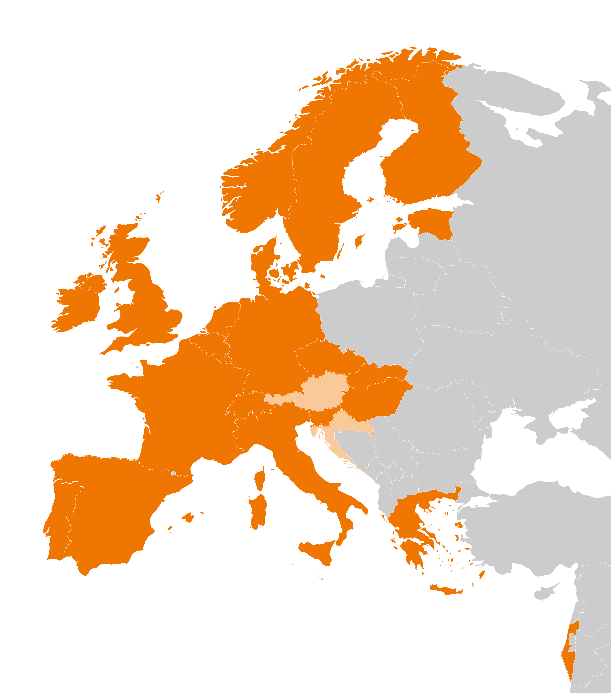

# ELIXIR Estonia

  

    
<strong>The purpose</strong> of <a href="https://www.elixir-europe.org">ELIXIR</a> is to construct and
    operate a sustainable infrastructure for biological information in Europe to
    support life science research and its translation to medicine and the
    environment, the bio-industries and society. These resources include databases,
    software tools, training materials, cloud storage and supercomputers.

    
<strong>The goal</strong> of <a href="https://www.elixir-europe.org">ELIXIR</a> is to coordinate these
    resources so that they form a single high quality infrastructure. This
    coordinated infrastructure makes it easier for researchers to find and share
    data, analyse their experiments, exchange knowledge, and agree on best
    practices.

    
<strong>Estonia</strong> joined <a href="https://www.elixir-europe.org">ELIXIR</a> as a full member in
    December 2013. The Estonian node focuses on developing and maintaining software
    tools and databases, linking of bioinformatics and biobanking, and last but not
    least, training researchers across borders.

    
Estonian ELIXIR Node is led by <strong><a href="https://www.ut.ee/en">University of Tartu</a></strong>.
    Other partners are
    <strong><a href="https://taltech.ee/en">Tallinn University of Technology</a></strong>,
    <strong><a href="https://kbfi.ee/?lang=en">National Institute for Physics and Biophysics</a></strong>,
    <strong><a href="https://www.tlu.ee/en">Tallinn University</a></strong>, and
    <strong><a href="https://www.emu.ee/en">Estonian University of Life Sciences</a></strong>.

  

  

    
  

---

<section id="lecturers" class="splide" aria-label="Our lecturers">
  

		

			

        
      

			

        
      

			

        
      

			

        
      

		</ul>
  

</section>

## Free spring courses 2026 by ELIXIR Estonia

__19.02.2026__ - [Crash Course in Data Management](news/posts/2026/Crash-course_DM_19_02.md) - Registration open

!!! note ""
    If you would like to be notified about the events, trainings and workshops
    running by ELIXIR Estonia, consider subscribing to [the announcements mailing
    list](https://lists.ut.ee/wws/subscribe/elixir.news?previous_action=edit_list_request)

## Latest news and announcements

### University of Tartu Electronic Lab Notebook usage survey by ELIXIR Estonia

Have you used electronic lab notebook? Would you like to? Please fill in [our survey](https://forms.office.com/e/re5vfzUnpZ). (For University of Tartu members only)

[More info](news/posts/2025/ELN_survey.md)

### New Microchip Electrospinning Technology Paves the Way for Probiotic Wound Treatments

We are proud to share a recent publication by our team member, Marilin Moor, who contributed to a study on advanced wound care. Published in Materials Today Bio, the article titled [“Living probiotics-loaded wound matrices prepared by microchip electrospinning”](https://doi.org/10.1016/j.mtbio.2025.102403) introduces a novel method for treating skin infections.

[More info](news/posts/2025/Microchip_Electrospinning_article.md)

### Review of An Intuitive Primer of Effective Genomics Study Design

[“*An Intuitive Primer on Effective Functional Genomics Study Design*”](https://www.amazon.com/Intuitive-Primer-Effective-Functional-Genomics/dp/B0DT9JLT6S/ref=sr_1_1?crid=5BI8RC5JVU7G&dib=eyJ2IjoiMSJ9.H120vigtXK6rCO9fMttISA.selz7w3qgD8ZD-Ijrx993KubvqGOUcg6QLVgb0saoZw&dib_tag=se&keywords=An+Intuitive+Primer+on+Effective+Functional+Genomics+Study+Design&qid=1760528768&sprefix=an+intuitive+primer+on+effective+functional+genomics+study+design%2Caps%2C171&sr=8-1) by [Yoav Gilad](https://www.linkedin.com/in/yoav-gilad-3a5589130/) provides a clear and accessible guide to the principles of effective functional genomics study design. Instead of prescribing fixed protocols, it encourages readers to think critically about their choices. For students, teachers, and researchers entering the field, it is an insightful and practical resource that I highly recommend.

[More info](news/posts/2025/Review_GenomicsStudyDesign.md)

### ELIXIR’s student topics for ATI Day 24.09.2025

ELIXIR Estonia is building and maintaining web tools and other resources for life science research. We aim to build things that last and are useful over a longer period. 
We offer 4 topics: 

* Topic 1: Modernising KEGGanim web application
* Topic 2: Contrastive Learning for Microscopy Image Understanding 
* Topic 3: Vision learning to understand how good a basketball player X is in situation Y? 
* Topic 4: Evaluating the Impact of Data Update Frequency on Functional Annotations Across 1000 Species Using g:Profiler data archives

[More info](news/posts/2025/Thesis_topics.md)

---
## External courses/materials

<text-tile
  title="Material: GRAY SCOTT SCHOOL 2025 - Revolutions"
  description="The GRAY SCOTT SCHOOL 2025 - Revolutions will be a deep dive into High Performance Computing, computing optimisation, profiling, and software engineering. Before the summer school, Gray Scott Thursdays are 17 webinars to guide you through important topics such as CPU/GPU architectures, Unit Tests, Computing Precision, Memory Allocation and profiling, with modern C++, Rust, Fortran and Python languages, and libraries such as Sycl, EVE, Vulkan, CUDA, Thrust, PyTorch."
  link="https://cta-lapp.pages.in2p3.fr/cours/gray_scott_revolutions/grayscottrevolution/index.html"
  linktext="More info and recordings"
  data-added-date="2025-08-17">
  </text-tile>

<text-tile
  title="Material: Deploying Nextflow pipelines in the cloud: a practical introduction"
  description="This webinar is designed for bioinformaticians, pipeline developers and users with a basic understanding of cloud computing concepts and Workflow Management systems. Throughout the session, you will learn how to configure a Nextflow pipeline, set up the necessary cloud infrastructure, and execute the BioSIFTR pipeline in the cloud."
  link="https://www.ebi.ac.uk/training/events/deploying-nextflow-pipelines-cloud-practical-introduction/"
  linktext="Recorded webinar and materials"
  data-added-date="2025-08-17">
  </text-tile>
  <text-tile
  title="WEBINAR recording: Deciphering AI for the Life Sciences"
  description="AI is reshaping life sciences by enabling researchers to analyze complex datasets, automate workflows, and gain deeper insights into biological processes. This introductory webinar will break down AI concepts, clarify key terminology, and showcase real-world examples of AI applications in the life sciences."
  link="https://www.youtube.com/watch?v=sbVzcrD-wko"
  linktext="More info"
  data-added-date="2025-08-17">
  </text-tile>

<text-tile
  title="Material: Building capacity in Single-Cell and Spatial Omics"
  description="A list of course instances collected by the recent training survey conducted by the ELIXIR Single-Cell Omics Community. These courses have materials inc. slides and exercises available online, some of them provide recorded lectures too."
  link="https://www.singlecellomics.org/pages/training/index"
  linktext="More info"
  data-added-date="2025-08-17">
  </text-tile>

<text-tile
 title="2026 EMBL Annual Poster for courses and conferences"
 description="The 2026 EMBL Annual Poster is out now, and it’s more than an events programme: it’s an invitation to discover what’s next in the life sciences."
 materials="https://www.embl.org/about/info/course-and-conference-office/wp-content/uploads/20250716_GenericPoster_2026_interaktiv.pdf"
 materialstext="Poster"
 data-added-date="2025-09-03">
 </text-tile>

<text-tile
 title="Material: Our journey incorporating AI into our cancer computational research"
 description="Dr. Anna Trigos session focuses on exploring the real-world challenges that many researchers face before any models are built or predictions made. Expect practical reflections, and inspiration for those at the beginning of their own AI journeys."
 materials="https://www.youtube.com/watch?v=vCkGbWuyLaQ"
 materialstext="Webinar recording"
 data-added-date="2025-10-14">
 </text-tile>

<text-tile
title="Material: Data publication"
description="The datasets produced during a research project is a treasure on its own, and should be treated as such. When publicly available and appropriately described, they are ready to be re-used by yourself as well as others. This lesson gives the why, where and how of data sharing via repository submission, including hands-on exercise on creating a data publication plan."
materials="https://nbisweden.github.io/module-data-publication-dm-practices/index.html"
materialstext="Material"
data-added-date="2025-11-19">
</text-tile>

  <text-tile
    title="Hybrid: Collectivity in living systems: emergence, function, and evolution"
    description="This symposium explores how complex collective behaviors arise from interactions within biological systems, spanning cells, tissues, organs, and groups of organisms. Sessions will cover coordination, cooperation, emergence, and decision-making, using a range of biological examples at both empirical and theoretical levels."
    link="https://www.embl.org/about/info/course-and-conference-office/events/ees26-01/"
    deadline="Registration deadline: 13 January 2026 (on-site), 17 February 2026 (virtual)"
    dates="Date: 24 – 27 February 2026"
    data-deadline-date="2026-02-18">
  </text-tile>

 <text-tile
  title="Hybrid: The new cardiobiology: engineering, vascular, and molecular insights"
  description="Cardiovascular disease remains the leading cause of death worldwide, with many mechanisms still to be discovered. This conference will focus on the latest advances in vascular engineering, cardiovascular regeneration, 3D disease modelling, cardiometabolic mechanisms, and the contribution of cardiovascular communication to multi-organ disease. It will unite experts across cardiac and vascular biology, tissue engineering, and systems biology, emphasizing metabolic stress in cardiovascular health."
  link="https://www.embl.org/about/info/course-and-conference-office/events/ncb26-01/"
  deadline="Registration deadline: 5 January 2026  (on-site),9 Feb 2026 (virtual)"
  dates="Date: 16 - 19 February 2026"
  data-deadline-date="2026-02-10">
 </text-tile>

<text-tile
title="Material: Data Repositories for Bioinformatics"
description="Are you working on a bioinformatic project generating data but unsure where to deposit it to make it open and FAIR? This beginner, asynchronous e-learning course teaches you what data repositories are, how they help manage bioinformatic data, and where you can deposit or find data for re-use. Designed for students, postdocs, researchers, and data managers, this 1-hour course can be completed online at your own pace."
materials="https://www.sib.swiss/training/course/2025_DREPB"
materialstext="Course material"
data-added-date="2025-11-19">
</text-tile>

 <text-tile
 title="Belgium: Type 2 immunity in homeostasis and disease (3rd edition)"
 description="Following previous successful editions, this conference in Ghent brings together leading experts to explore new insights into type 2 immunity. It covers effector mechanisms, cell interactions, neuro/endocrine crosstalk, and roles in pathology, allergy, infectious disease, cancer, and fibrosis. Essential for researchers interested in therapeutic strategies targeting type 2 pathways."
 link="https://www.vibconferences.be/events/type-2-immunity-in-homeostasis-and-disease-3rd-edition"
 deadline="Registration deadline: 23 February 2026"
 dates="Date: 9 - 10 March 2026"
 data-deadline-date="2026-02-24">
 </text-tile>

 <text-tile
  title="Belgium: Analysis of single-cell RNASeq data"
  description="Single-cell RNASeq provides transcriptome data from single cells and enables the discovery of heterogeneous cell populations, cell types, and developmental trajectories, which are masked in bulk RNASeq. This hands-on course covers the complete pipeline for analyzing short-read scRNASeq data, including quality control, clustering, marker gene identification, and differential expression analysis. On the second day, participants are encouraged to bring their own data for analysis."
  link="https://training.vib.be/all-trainings/analysis-single-cell-rnaseq-data-13"
  deadline="Registration deadline: 30 January 2026"
  dates="Date: 9 February 2026 & 16 February 2026"
  data-deadline-date="2026-01-31">
 </text-tile>

 <text-tile
 title="Hybrid: AI and biology"
 description="Artificial intelligence is revolutionizing all areas of science, and the life sciences are no exception. This symposium catalyses interaction between AI and biology researchers, exploring shared theoretical approaches, cross-domain experiments, data integration, and the future of AI in sequencing, imaging, and structural biology. It brings together global experts to discuss theoretical, methodological, and strategic issues for the next generation of biological discovery."
 link="https://www.embl.org/about/info/course-and-conference-office/events/ees26-02/"
 deadline="Registration deadline: 27 January 2026 (On-site), 3 March 2026 (Virtual)"
 dates="Date: 10 - 13 March 2026"
 data-deadline-date="2026-03-04">
 </text-tile>

<text-tile
title="SIB Swiss Institute of Bioinformatics training calendar 2026"
materials="https://www.sib.swiss/training/upcoming-training-courses"
materialstext="Link"
data-added-date="2025-11-19">
</text-tile>

  <text-tile
    title="Material: Metadata"
    description="The aim of this lesson is to explain why metadata is crucial for making data more FAIR and how it influences data discoverability and reuse. It introduces metadata standards, controlled vocabularies, and ontologies, and shows how these can be applied to describe data in a consistent and structured way. Participants also learn practical strategies for documenting which standards they use and for finding suitable ontologies for their own datasets."
    materials="https://nbisweden.github.io/module-metadata-dm-practices/index.html"
    materialstext="Lesson homepage"
    data-added-date="2025-12-15">
  </text-tile>

  <text-tile
    title="Material: Data organisation practices"
    description="This lesson introduces core principles for organising digital research data so that projects remain understandable, reusable, and ready for collaboration over time. It explains how careful structuring of files, folders, and documentation underpins efficient workflows and supports later publication and data sharing. Participants also explore practical approaches for keeping research records and structuring tabular data and metadata."
    materials="https://nbisweden.github.io/module-organising-data-dm-practices/index.html"
    materialstext="Material page"
    data-added-date="2025-12-15">
  </text-tile>

  <text-tile
    title="Belgium: Tracer metabolomics"
    description="Understanding metabolic fluxes is crucial for uncovering how diseases, drugs, and genetic changes affect cellular biochemistry, and tracer metabolomics tracks labelled substrates through metabolic pathways to study these dynamic processes. This three-day, in-person course in Leuven provides foundational concepts, experimental design tips, and practical exposure to tracer metabolomics workflows, including data interpretation and a guided tour of the Metabolomics Core facility."
    link="https://training.vib.be/all-trainings/tracer-metabolomics"
    deadline="Registration deadline: 1 February 2026"
    dates="Date: 11 – 13 February 2026"
    data-deadline-date="2026-02-02">
  </text-tile>

  <text-tile
    title="Hybrid: The cellular mechanics of symbiosis: sensing friend from foe"
    description="This EMBO | EMBL symposium explores how host–microbe interactions shift along the spectrum from pathogenic to beneficial, focusing on the cellular systems and metabolic pathways that drive changes in symbiotic states. The meeting will bring together researchers using cellular, molecular, ecological, physiological and theoretical approaches to understand how hosts distinguish friends from foes and maintain stable, specific partnerships with microbes."
    link="https://www.embl.org/about/info/course-and-conference-office/events/ees26-03/"
    deadline="Registration deadline:  (on-site) 3 February 2026;  (virtual) 10 March 2026"
    dates="Date: 17 – 20 March 2026"
    data-deadline-date="2026-03-11">
  </text-tile>

  <text-tile
    title="Belgium: Spatial metabolomics"
    description="This training introduces spatial metabolomics using mass spectrometry imaging to directly detect metabolites, lipids, and proteins from tissue sections. It targets researchers in metabolomics and provides hands-on experience with tools such as the Cardinal Shiny app in R and IsoScope for processing, visualization, and analysis of spatial (tracer) metabolomics data. By the end of the course, participants will be able to integrate a spatial dimension into their metabolomics workflows and interpret mass spectrometry imaging results."
    link="https://training.vib.be/all-trainings/spatial-metabolomics"
    deadline="Registration deadline: 8 February 2026"
    dates="Date: 17 February 2026"
    data-deadline-date="2026-02-09">
  </text-tile>

  <text-tile
    title="Hybrid: Biological oscillators: rhythms and synchronisation across scales"
    description="This symposium explores oscillatory phenomena in biological and natural systems across temporal and spatial scales, bringing together researchers working on molecular, organismal, ecological, and planetary rhythms. Topics include neuronal and cardiac dynamics, circadian and developmental rhythms, as well as oscillations in ecological and climate systems, with a strong focus on bridging experimental and theoretical perspectives to uncover common principles of rhythmic behaviour."
    link="https://www.embl.org/about/info/course-and-conference-office/events/ees26-04/"
    deadline="Registration deadline:10 February 2026 (on-site); 17 March 2026 (virtual)"
    dates="Date: 24 – 27 March 2026"
    data-deadline-date="2026-003-18">
  </text-tile>

  <text-tile
    title="Switzerland: Biology-informed Integration and Visualization of Multiomics Data"
    description="This 3-day course introduces practical strategies to integrate and visualise multiomics datasets, including ATAC-seq, RNA-seq, ChIP-seq and bisulphite-seq, to obtain a comprehensive view of regulatory mechanisms in biological systems. Participants will learn to process and combine pre-processed datasets, build overlap matrices, perform functional analyses and produce advanced visualisations that clearly communicate complex findings. The course is highly hands-on and project-based, enabling participants to directly apply the methods to real multiomics research data in group projects." 
    link="https://www.sib.swiss/training/course/20260217_BIVMD"
    deadline="Registration deadline: 06 February 2026" 
    dates="Date: 17 - 19 February 2026"
    data-deadline-date="2026-02-07">
  </text-tile>

  <text-tile
    title="Italy: Summer School on Biomolecular Simulations 2026"
    description="This on-site summer school in Sardinia provides a comprehensive combination of lectures and hands-on tutorials on biomolecular modelling and simulations using modern applications and tools. Participants will learn to use flagship software such as GROMACS, HADDOCK, PMX and BioExcel Building Blocks (BioBB) while also gaining exposure to topics like docking, free energy calculations, and advanced sampling methods."
    link="https://bioexcel.eu/events/summer-school-on-biomolecular-simulations-2026/"
    deadline="Registration deadline: 1 February 2026"
    dates="Date: 7 – 12 June 2026"
    data-deadline-date="2026-02-02">
  </text-tile>

  <text-tile
    title="Material: Repository Resilience"
    description="This page introduces the Repository Crisis Scorecards project, which helps data repositories assess their resilience to disruptions such as outages, disasters, and funding changes. It explains how the tool, surveys, and focus groups collectively support better planning, risk mitigation, and community-wide understanding of repository resilience."
    materials="https://www.esipfed.org/repository-resilience/"
    materialstext="Materials page"
    data-added-date="2025-12-15">
  </text-tile>

  <text-tile
    title="Sweden: RaukR 2026 – Summer school – Data Science With R"
    description="The R programming language is a powerful tool for data transformation, statistical analysis, and creating publication-ready visualizations. This workshop goes beyond the basics, giving participants a comprehensive understanding of the R ecosystem, including best coding practices, code profiling, data wrangling, generating reports from notebooks, and developing web applications using R."
    link="https://nbisweden.github.io/raukr-2026/"
    deadline="Registration deadline: 1 May 2026"
    dates="Date: 10–20 August 2026"
    data-deadline-date="2026-05-02">
  </text-tile>

  <text-tile
    title="Finland: CSC Spring School on Computational Chemistry 2026"
    description="The Spring School provides a comprehensive tutorial-style introduction to essential methods in molecular modelling and computational chemistry using modern supercomputers. It covers classical molecular dynamics, electronic structure theory, and special topics such as enhanced sampling methods and potential energy surface exploration. The school is aimed at graduate students and researchers, as well as industrial participants seeking a hands-on crash course in computational modelling and networking opportunities."
    link="https://csc.fi/en/training-calendar/csc-spring-school-on-computational-chemistry-2026/"
    deadline="Registration deadline: 8 March 2026"
    dates="Date: 8 – 10 April 2026"
    data-deadline-date="2026-03-09">
  </text-tile>

  <text-tile
    title="Online: Mastering Research Data Management for Human Data: Safeguarding Sensitive Information and Elevating Data Security 2026"
    description="This interactive online course focuses on research data management principles for human data, combining presentations with hands-on exercises on managing sensitive information. It covers ethical and legal aspects, GDPR compliance, and best practices for securely handling, storing, and sharing human research data."
    link="https://www.denbi.de/training-courses-2025/1989-mastering-research-data-management-for-human-data-safeguarding-sensitive-information-and-elevating-data-security-2026"
    dates="Date: 27 - 28 January 2026"
    data-deadline-date="2026-01-27">
  </text-tile>

  <text-tile
    title="Online: Training Clinic - February 2026"
    description="The Training Clinic aims to equip participants with practical knowledge and skills to design and deliver more effective training courses and create better training material. It targets current and aspiring trainers who want to improve their training practice, connect with peers, and exchange problem-solving approaches in an interactive format."
    link="https://www.denbi.de/training-courses-2025/1999-training-clinic-february-2026"
    dates="Date: 3 February 2026"
    data-deadline-date="2026-02-03">
  </text-tile>

<text-tile
title="Material: The loss of community in open science: a sign of a failing movement?"
description="This article examines why the open science movement has struggled to achieve lasting change despite decades of effort, highlighting how traditional publishers, weak leadership, and a lack of cultural focus have limited progress. It argues that neglecting community building—through lost grassroots initiatives, homogenised voices, and underfunded community efforts—has made the movement fragile and overly top‑down, and calls for renewed, diverse, community‑driven leadership to avoid long‑term failure."
materials="https://www.themodernpeer.com/the-loss-of-community-in-open-science-a-sign-of-a-failing-movement/"
data-added-date="2025-12-17">
</text-tile>

