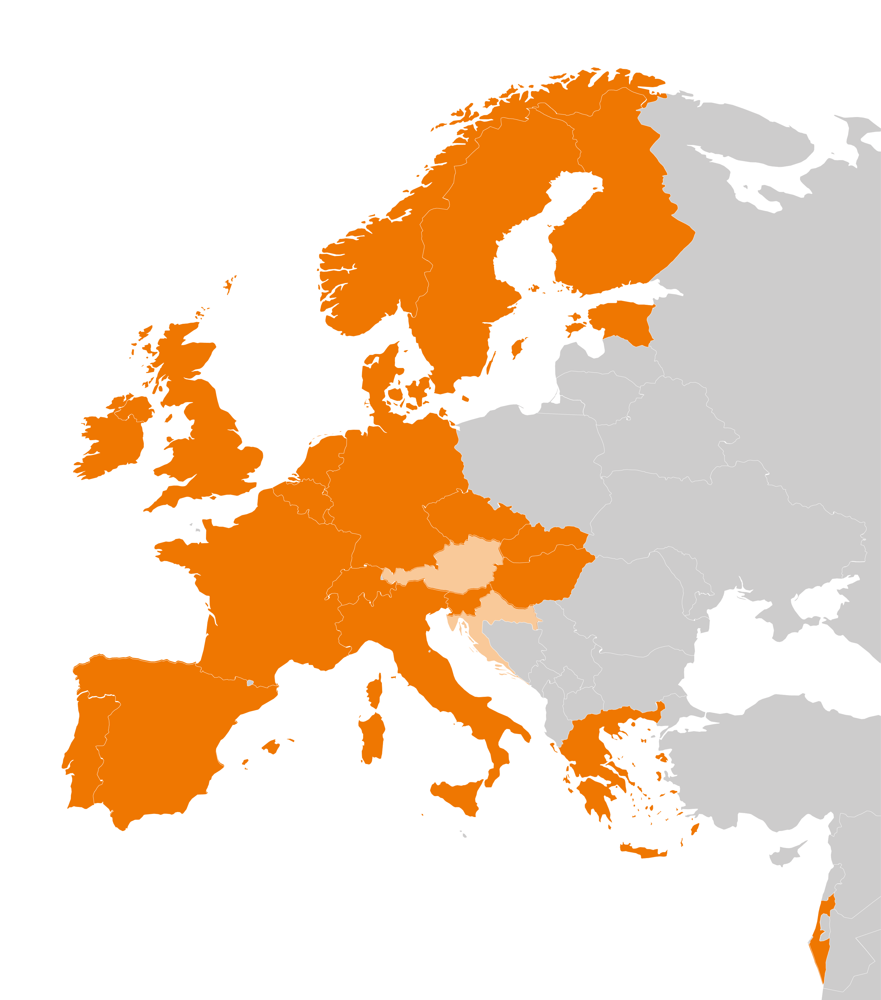

# ELIXIR Estonia

  

    
<strong>The purpose</strong> of <a href="https://www.elixir-europe.org">ELIXIR</a> is to construct and
    operate a sustainable infrastructure for biological information in Europe to
    support life science research and its translation to medicine and the
    environment, the bio-industries and society. These resources include databases,
    software tools, training materials, cloud storage and supercomputers.

    
<strong>The goal</strong> of <a href="https://www.elixir-europe.org">ELIXIR</a> is to coordinate these
    resources so that they form a single high quality infrastructure. This
    coordinated infrastructure makes it easier for researchers to find and share
    data, analyse their experiments, exchange knowledge, and agree on best
    practices.

    
<strong>Estonia</strong> joined <a href="https://www.elixir-europe.org">ELIXIR</a> as a full member in
    December 2013. The Estonian node focuses on developing and maintaining software
    tools and databases, linking of bioinformatics and biobanking, and last but not
    least, training researchers across borders.

    
Estonian ELIXIR Node is led by <strong><a href="https://www.ut.ee/en">University of Tartu</a></strong>.
    Other partners are
    <strong><a href="https://taltech.ee/en">Tallinn University of Technology</a></strong>,
    <strong><a href="https://kbfi.ee/?lang=en">National Institute for Physics and Biophysics</a></strong>,
    <strong><a href="https://www.tlu.ee/en">Tallinn University</a></strong>, and
    <strong><a href="https://www.emu.ee/en">Estonian University of Life Sciences</a></strong>.

  

  

    
  

---

<section id="lecturers" class="splide" aria-label="Our lecturers">
  

		

			

        
      

			

        
      

			

        
      

			

        
      

		</ul>
  

</section>

## Free spring courses 2026 by ELIXIR Estonia

* __12.03.2026__ - [Data visualisation (theory)](news/posts/2026/Data_visualisation_theory_12_03.md)

* __17.03.2026__ - [CodeRefinery workshop for reproducible research code - March 17-19 and 24-26, 2026](news/posts/2026/CodeRefinery_march_local.md) - Registration open

* __02.04.2026__ - [Data Visualisation with RStudio](news/posts/2026/Data_visualisation_RStudio_02-04.md) - Registration open

* __08.04.2026__ - [Bring your own DMP workshop](news/posts/2026/BYO_DMP_08-04.md) - Registration open

!!! note ""
    If you would like to be notified about the events, trainings and workshops
    running by ELIXIR Estonia, consider subscribing to [the announcements mailing
    list](https://lists.ut.ee/wws/subscribe/elixir.news?previous_action=edit_list_request)

## Latest news and announcements

### University of Tartu Electronic Lab Notebook usage survey by ELIXIR Estonia

Have you used electronic lab notebook? Would you like to? Please fill in [our survey](https://forms.office.com/e/re5vfzUnpZ). (For University of Tartu members only)

[More info](news/posts/2025/ELN_survey.md)

### ELIXIR Estonia’s July to December 2025 Highlights

In the second half of 2025, ELIXIR Estonia continued to deepen its collaborations in research data management, both within Estonia and across Europe, while also expanding staff involvement in training activities and knowledge-sharing initiatives. Throughout the period, we placed a stronger focus on data management by participating in and organising events in partnership. A standout moment was co-organising a [Nordic Computational Biology Week Conference](https://www.nordic-compbio.org/ncb-week), an experience that will help us take on larger events in the future. Alongside these activities, our team contributed three new publications, reflecting our ongoing commitment to advancing research and supporting the broader scientific community.

[More info](news/posts/2026/Newsletter_2025-02.md)

### New Microchip Electrospinning Technology Paves the Way for Probiotic Wound Treatments

We are proud to share a recent publication by our team member, Marilin Moor, who contributed to a study on advanced wound care. Published in Materials Today Bio, the article titled [“Living probiotics-loaded wound matrices prepared by microchip electrospinning”](https://doi.org/10.1016/j.mtbio.2025.102403) introduces a novel method for treating skin infections.

[More info](news/posts/2025/Microchip_Electrospinning_article.md)

### Review of An Intuitive Primer of Effective Genomics Study Design

[“*An Intuitive Primer on Effective Functional Genomics Study Design*”](https://www.amazon.com/Intuitive-Primer-Effective-Functional-Genomics/dp/B0DT9JLT6S/ref=sr_1_1?crid=5BI8RC5JVU7G&dib=eyJ2IjoiMSJ9.H120vigtXK6rCO9fMttISA.selz7w3qgD8ZD-Ijrx993KubvqGOUcg6QLVgb0saoZw&dib_tag=se&keywords=An+Intuitive+Primer+on+Effective+Functional+Genomics+Study+Design&qid=1760528768&sprefix=an+intuitive+primer+on+effective+functional+genomics+study+design%2Caps%2C171&sr=8-1) by [Yoav Gilad](https://www.linkedin.com/in/yoav-gilad-3a5589130/) provides a clear and accessible guide to the principles of effective functional genomics study design. Instead of prescribing fixed protocols, it encourages readers to think critically about their choices. For students, teachers, and researchers entering the field, it is an insightful and practical resource that I highly recommend.

[More info](news/posts/2025/Review_GenomicsStudyDesign.md)

---
## External courses/materials

<text-tile
 title="Material: Our journey incorporating AI into our cancer computational research"
 description="Dr. Anna Trigos session focuses on exploring the real-world challenges that many researchers face before any models are built or predictions made. Expect practical reflections, and inspiration for those at the beginning of their own AI journeys."
 materials="https://www.youtube.com/watch?v=vCkGbWuyLaQ"
 materialstext="Webinar recording"
 data-added-date="2025-10-14">
 </text-tile>

<text-tile
title="Material: Data publication"
description="The datasets produced during a research project is a treasure on its own, and should be treated as such. When publicly available and appropriately described, they are ready to be re-used by yourself as well as others. This lesson gives the why, where and how of data sharing via repository submission, including hands-on exercise on creating a data publication plan."
materials="https://nbisweden.github.io/module-data-publication-dm-practices/index.html"
materialstext="Material"
data-added-date="2025-11-19">
</text-tile>

<text-tile
title="Material: Data Repositories for Bioinformatics"
description="Are you working on a bioinformatic project generating data but unsure where to deposit it to make it open and FAIR? This beginner, asynchronous e-learning course teaches you what data repositories are, how they help manage bioinformatic data, and where you can deposit or find data for re-use. Designed for students, postdocs, researchers, and data managers, this 1-hour course can be completed online at your own pace."
materials="https://www.sib.swiss/training/course/2025_DREPB"
materialstext="Course material"
data-added-date="2025-11-19">
</text-tile>

<text-tile
title="SIB Swiss Institute of Bioinformatics training calendar 2026"
materials="https://www.sib.swiss/training/upcoming-training-courses"
materialstext="Link"
data-added-date="2025-11-19">
</text-tile>

  <text-tile
    title="Material: Metadata"
    description="The aim of this lesson is to explain why metadata is crucial for making data more FAIR and how it influences data discoverability and reuse. It introduces metadata standards, controlled vocabularies, and ontologies, and shows how these can be applied to describe data in a consistent and structured way. Participants also learn practical strategies for documenting which standards they use and for finding suitable ontologies for their own datasets."
    materials="https://nbisweden.github.io/module-metadata-dm-practices/index.html"
    materialstext="Lesson homepage"
    data-added-date="2025-12-15">
  </text-tile>

  <text-tile
    title="Material: Data organisation practices"
    description="This lesson introduces core principles for organising digital research data so that projects remain understandable, reusable, and ready for collaboration over time. It explains how careful structuring of files, folders, and documentation underpins efficient workflows and supports later publication and data sharing. Participants also explore practical approaches for keeping research records and structuring tabular data and metadata."
    materials="https://nbisweden.github.io/module-organising-data-dm-practices/index.html"
    materialstext="Material page"
    data-added-date="2025-12-15">
  </text-tile>

  <text-tile
    title="Hybrid: Biological oscillators: rhythms and synchronisation across scales"
    description="This symposium explores oscillatory phenomena in biological and natural systems across temporal and spatial scales, bringing together researchers working on molecular, organismal, ecological, and planetary rhythms. Topics include neuronal and cardiac dynamics, circadian and developmental rhythms, as well as oscillations in ecological and climate systems, with a strong focus on bridging experimental and theoretical perspectives to uncover common principles of rhythmic behaviour."
    link="https://www.embl.org/about/info/course-and-conference-office/events/ees26-04/"
    deadline="Registration deadline:10 February 2026 (on-site); 17 March 2026 (virtual)"
    dates="Date: 24 – 27 March 2026"
    data-deadline-date="2026-03-18">
  </text-tile>

  <text-tile
    title="Material: Repository Resilience"
    description="This page introduces the Repository Crisis Scorecards project, which helps data repositories assess their resilience to disruptions such as outages, disasters, and funding changes. It explains how the tool, surveys, and focus groups collectively support better planning, risk mitigation, and community-wide understanding of repository resilience."
    materials="https://www.esipfed.org/repository-resilience/"
    materialstext="Materials page"
    data-added-date="2025-12-15">
  </text-tile>

  <text-tile
    title="Sweden: RaukR 2026 – Summer school – Data Science With R"
    description="The R programming language is a powerful tool for data transformation, statistical analysis, and creating publication-ready visualizations. This workshop goes beyond the basics, giving participants a comprehensive understanding of the R ecosystem, including best coding practices, code profiling, data wrangling, generating reports from notebooks, and developing web applications using R."
    link="https://nbisweden.github.io/raukr-2026/"
    deadline="Registration deadline: 1 May 2026"
    dates="Date: 10–20 August 2026"
    data-deadline-date="2026-05-02">
  </text-tile>

<text-tile
title="Material: The loss of community in open science: a sign of a failing movement?"
description="This article examines why the open science movement has struggled to achieve lasting change despite decades of effort, highlighting how traditional publishers, weak leadership, and a lack of cultural focus have limited progress. It argues that neglecting community building—through lost grassroots initiatives, homogenised voices, and underfunded community efforts—has made the movement fragile and overly top‑down, and calls for renewed, diverse, community‑driven leadership to avoid long‑term failure."
materials="https://www.themodernpeer.com/the-loss-of-community-in-open-science-a-sign-of-a-failing-movement/"
data-added-date="2025-12-17">
</text-tile>

  <text-tile
    title="Online: CodeRefinery workshop"
    description="This free online workshop introduces best practices for version control, collaborative coding, testing, documentation, and reproducible research aimed at researchers and scientists using code in their work. It combines lectures with hands-on exercises, and participants can join only the days or sessions most relevant to them. The event is streamed and also supports local in-person study groups at several universities."
    link="https://coderefinery.github.io/2026-03-17-workshop/"
    dates="Date: 17–19 and 24–26 March 2026"
    data-deadline-date="2026-03-26">
  </text-tile>

  <text-tile
    title="Hybrid: Cellular mechanisms driven by phase separation"
    description="This EMBO | EMBL Symposium explores how intracellular phase transitions and biomolecular condensates organise cellular space and time. It brings together experts from cell biology, genetics, biochemistry, biophysics, and soft matter physics to discuss principles of condensate formation, cellular adaptation, and disease. The meeting aims to foster interdisciplinary collaborations and inspire new approaches to understanding cellular organisation and robustness."
    link="https://www.embl.org/about/info/course-and-conference-office/events/ees26-08/"
    deadline="Registration deadline: 7 April 2026 (on-site) / 12 May 2026 (virtual)"
    dates="Date: 19 - 22 May 2026"
    data-deadline-date="2026-05-12">
  </text-tile>

<text-tile
title="Hybrid: Sex differences in health and disease"
description="TThis symposium will take place at EMBL Heidelberg with the option to attend virtually and will bring together scientists to explore how sex differences impact physiology, disease susceptibility, treatment response and underlying molecular mechanisms, drawing on both classic models and cutting-edge approaches. Topics include hormone regulation of immunity, genetic drivers of disease differences and systems approaches to sexual dimorphisms across species."
link="https://www.embl.org/about/info/course-and-conference-office/events/ees26-07/"
deadline="Registration deadline: 16 March 2026 (on-site) / 23 April 2026 (virtual)"
dates="Date: 27 – 30 April 2026"
data-deadline-date="2026-04-24">
</text-tile>

<text-tile
title="Spain: Building networks: engineering in vascular biology"
description="This EMBO Workshop will take place at EMBL Barcelona and brings together researchers at the intersection of engineering and vascular biology to discuss advances in spatial omics, imaging and bioengineered models of vascular systems. The programme covers vascular development and identity, mechano-vascular biology, computational models and new in vitro approaches to study vascular biology."
link="https://www.embl.org/about/info/course-and-conference-office/events/evb26-01/"
deadline="Registration deadline: 1 April 2026"
dates="Date: 13 – 15 May 2026"
data-deadline-date="2026-04-02">
</text-tile>

<text-tile
title="Online: Integrating single-cell and spatial transcriptomics to map the rules of neurological conditions"
description="This webinar discusses approaches for integrating single-cell and spatial transcriptomics data to study neurological conditions and understand cellular organisation in the brain."
link="https://www.ebi.ac.uk/training/events/integrating-single-cell-spatial-transcriptomics-to-map-rules-neurological-conditions/"
dates="Date: 18 March 2026"
data-deadline-date="2026-03-18">
</text-tile>

<text-tile
title="Online: Managing spatial data: insights from developing the HuBMAP data portal"
description="This webinar presents challenges and solutions for managing large-scale spatial data, drawing on experience from developing the Human Biomolecular Atlas Program data portal."
link="https://www.ebi.ac.uk/training/events/managing-spatial-data-insights-from-developing-hubmap-data-portal/"
dates="Date: 1 April 2026"
data-deadline-date="2026-04-01">
</text-tile>

<text-tile
title="Online: Spatial transcriptomics in action: a case study from human reproductive development"
description="This webinar showcases a real-world case study applying spatial transcriptomics to human reproductive development, highlighting biological insights and analytical approaches."
link="https://www.ebi.ac.uk/training/events/spatial-transcriptomics-in-action-case-study-human-reproductive-development/"
dates="Date: 8 April 2026"
data-deadline-date="2026-04-08">
</text-tile>

<text-tile
title="Material: Communities as Policy Instruments"
description="This publication explains how communities can be used as effective policy instruments by the European Commission to bridge the gap between policy design and implementation through stakeholder-driven collaboration, structured dialogue, and peer learning. It argues that beyond traditional regulation or funding programmes, communities help close implementation gaps, encourage shared purpose among actors, and translate policy into practice in more adaptive, inclusive ways."
materials="https://knowledge4policy.ec.europa.eu/publication/communities-policy-instruments_en"
materialstext="Publication"
data-added-date="2026-02-09">
</text-tile>

<text-tile
title="Material: Open Science and FAIR"
description="This lesson introduces the principles of Open Science and the FAIR data principles, helping learners reflect on why openness and transparency are becoming central in research. You’ll gain an understanding of the reasons for Open Science, what FAIR means for research data, and emerging expectations from the wider research ecosystem."
materials="https://nbisweden.github.io/module-open-science-dm-practices/index.html"
materialstext="Material"
data-added-date="2026-02-16">
</text-tile>

<text-tile
title="Material: Cleaning tabular data with OpenRefine"
description="This lesson introduces OpenRefine, a powerful open-source tool for cleaning and transforming messy tabular data as part of a reproducible data workflow. You’ll learn how to import, clean, filter, sort, and export data as well as how to track and reuse your steps to save time and improve reproducibility."
materials="https://nbisweden.github.io/module-openrefine-dm-practices/"
materialstext="Material"
data-added-date="2026-02-16">
</text-tile>

<text-tile
title="Hybrid: Brain (epi)genome"
description="This EMBO-funded workshop brings together leaders in genomics, neuroscience, and epigenetics to explore how the genome and epigenome shape brain cell diversity, function and disease. The programme features cutting-edge sessions on neural identity, chromatin dynamics, epigenomics of brain plasticity and neurological disorders, and the latest single-cell and spatial genomics approaches."
link="https://www.embl.org/about/info/course-and-conference-office/events/brg26-01/"
deadline="Registration deadline: 10 March 2026 (on-site) / 14 Apr 2026 (virtual)"
dates="Date: 21 – 24 April 2026"
data-deadline-date="2026-04-15">
</text-tile>

<text-tile
title="Germany: Synthetic biology in action: maturing tools and their potential"
description="This course explores cutting-edge synthetic biology tools through lectures and practical modules in genome engineering, RNA-based control systems, and AI-assisted design across diverse biological systems."
link="https://www.embl.org/about/info/course-and-conference-office/events/syn26-01/"
deadline="Registration deadline: 24 March 2026"
dates="Date: 30 June – 6 July 2026"
data-deadline-date="2026-03-25">
</text-tile>

<text-tile
title="Germany: Single-Cell RNA-Seq Data Analysis"
description="This workshop provides a comprehensive introduction to the analysis of single-cell RNA sequencing (scRNA-seq) data, covering quality control, normalization, dimensionality reduction, clustering, and differential expression analysis. Participants will gain hands-on experience using established bioinformatics tools and workflows to interpret and visualise single-cell transcriptomic data."
link="https://www.ecseq.com/workshops/workshop_2026-03-Single-Cell-RNA-Seq-Data-Analysis"
deadline="Registration deadline: 20 March 2026"
dates="Date: 23 – 25 March 2026"
data-deadline-date="2026-03-21">
</text-tile>

<text-tile
title="Online: Single cell RNAseq data analysis"
description="This course covers the foundations of bioinformatic analysis of single cell RNA-seq and aims to provide participants with the theoretical knowledge and practical tools needed for robust analyses. Through a combination of lectures and hands-on exercises in R or Python, participants will learn to run analyses on their own data, select appropriate methods and interpret the results."
link="https://uppsala.instructure.com/courses/119502"
deadline="Registration deadline: 13 March 2026"
dates="Date: 13 - 16 April and 27 April 2026"
data-deadline-date="2026-03-14">
</text-tile>

<text-tile
title="Hybrid: Practical Deep Learning"
description="This course gives a practical introduction to deep learning, including common neural network architectures such as convolutional, recurrent and transformer models, as well as GPU computing and hands-on exercises using PyTorch. Participants will get to run exercises on the GPU-accelerated LUMI supercomputer and can join either on-site in Espoo, Finland or remotely via Zoom."
link="https://csc.fi/en/training-calendar/practical-deep-learning-7/"
dates="Date: 14 – 15 April 2026"
data-deadline-date="2026-04-14">
</text-tile>

<text-tile
title="Germany: Biodiversity Bioinformatics Summer School"
description="This intensive summer school provides hands-on training in biodiversity bioinformatics, covering environmental DNA (eDNA) metabarcoding, genome assembly and annotation, biodiversity metrics, and comparative genomics. Designed for life science researchers and PhD students, the course combines lectures with collaborative projects and practical pipeline work to build skills in analysis and interpretation of biodiversity data."
link="https://www.sib.swiss/training/course/20260621_SSBIB"
deadline="Registration deadline: 16 March 2026"
dates="Date: 21 – 26 June 2026"
data-deadline-date="2026-03-17">
</text-tile>

<text-tile
title="Online: Genome Annotation Workshop 2026"
description="The Genome Annotation Workshop offers a comprehensive, 3-day virtual training in eukaryotic genome annotation. Participants will learn about sequencing technologies, transcriptome assembly, gene prediction methodologies, and hands-on annotation tool usage to improve their genome annotation workflows."
link="https://www.earlham.ac.uk/events/genome-annotation-workshop-2026"
deadline="Registration deadline: 22 March 2026"
dates="Date: 28 – 30 April 2026"
data-deadline-date="2026-03-23">
</text-tile>

<text-tile
title="Material: Welcome to the Research Data Management Video Series"
description="This introductory video presents a comprehensive video series on research data management, from planning and organizing data to sharing it ethically and effectively. It explains the recommended viewing order and highlights how the series supports students, early-career researchers, and data stewards in building good data practices across disciplines."
materials="https://www.youtube.com/watch?v=GBrpv8ZzBZ0&list=PLCgtsnEJOw6zUBZv7lqWiWAcEbv5n41JK"
materialstext="Video series"
data-added-date="2026-03-06">
</text-tile>

<text-tile
title="useR! 2026 Conference — Warsaw, Poland"
description="The useR! 2026 conference brings together R users, developers, and data scientists worldwide for talks, workshops, and community collaboration, organized by volunteers and supported by the R Foundation."
link="https://user2026.r-project.org/"
deadline="Registration deadline: 6 June 2026"
dates="Date: 6 - 9 July 2026"
data-deadline-date="2026-06-07">
</text-tile>

<text-tile
title="Hybrid: Mechanobiology across the tree of life"
description="This EMBO | EMBL Symposium explores the principles and mechanisms by which cells and tissues build themselves and respond to their environment, with interdisciplinary insights from biology, physics, and engineering."
link="https://www.embl.org/about/info/course-and-conference-office/events/ees26-06/"
deadline="Registration deadline: 28 April 2026 (On-site); 2 June 2026 (Virtual)"
dates="Date: 9 - 12 June 2026"
data-deadline-date="2026-06-03">
</text-tile>

<text-tile
title="Netherlands: RNA-seq Data Analysis – 2026"
description="This 5-day intensive BioSB course offers hands-on training in RNA-seq data analysis, spanning experimental design, preprocessing, bulk and single-cell workflows, and practical use of analysis tools."
link="https://www.dtls.nl/courses/rna-seq-data-analysis-2026/"
deadline="Registration: early bird until 06 April 2026; wildcard until 20 April 2026"
dates="Date: 1 - 5 June 2026"
data-deadline-date="2026-04-21">
</text-tile>

<text-tile
title="Material: RDA and National Open Science Policies"
description="RDA’s interactive resource maps RDA groups, recommendations and outputs to European national Open Science policies, showing how RDA’s community-driven work supports strategic open science needs across Europe. This resource highlights areas of current support and opportunities to strengthen national and regional research data and open science policy alignment. Explore the mapping to see how RDA contributes to FAIR data and open science policy frameworks."
materials="https://www.rd-alliance.org/rda-and-national-open-science-policies/"
materialstext="Interactive resource"
data-added-date="2026-03-06">
</text-tile>

<text-tile
title="Belgium: Bioimage analysis in Python"
description="This introductory course provides researchers with practical skills for handling and processing microscopy images using Python. Participants will learn to visualize, manipulate, and analyze multi-dimensional image data and apply essential image analysis tasks interactively with tools such as Napari."
link="https://training.vib.be/all-trainings/bioimage-analysis-python"
deadline="Registration deadline: 8 April 2026"
dates="Date: 21 – 22 April 2026"
data-deadline-date="2026-04-09">
</text-tile>

<text-tile
title="Hybrid: BioMalPar XXII: biology and pathology of the malaria parasite"
description="This international conference brings together researchers to highlight recent advances in basic and translational research on malaria parasites, their interactions with hosts and vectors, and development of new interventions."
link="https://www.embl.org/about/info/course-and-conference-office/events/bmp26-01/"
deadline="Registration deadline: 15 April 2026 in-person; 20 May 2026 Virtual"
dates="Date: 27 – 29 May 2026"
data-deadline-date="2026-05-21">
</text-tile>

<text-tile
title="Belgium: Spatial omics (2nd edition)"
description="This VIB Tools & Technologies conference highlights cutting-edge advances in spatial transcriptomics, proteomics, metabolomics, and multi-modal strategies to uncover spatial organization in biological systems."
link="https://www.vibconferences.be/events/spatial-omics-2nd-edition"
deadline="Registration deadline: 8 June 2026"
dates="Date: 22 – 24 June 2026"
data-deadline-date="2026-06-09">
</text-tile>

<text-tile
title="Material: A fast, accurate ‘sequence search engine’"
description="The MetaGraph tool can rapidly search through millions of published DNA, RNA, and protein sequences, overcoming current limitations in analysing vast biological data. Developed by SIB scientists at ETH Zurich and published in Nature, this tool functions like a search engine for biological sequences, accelerating life-science research and biomedical discovery."
materials="https://www.sib.swiss/news/a-fast-accurate-sequence-search-engine"
materialstext="Webpage"
data-added-date="2026-03-06">
</text-tile>

<text-tile
title="Material: Fellows’ Complementary Skills Resources"
description="The EMBL Fellows’ Career Service’s complementary skills resources page provides a curated collection of openly available tools and guides to help early-career life scientists strengthen key professional competencies. It includes resources covering communication, leadership, professionalism, career development, project management, and related transferable skills, with links to practical guides, checklists, webinars, and further materials to support career readiness."
materials="https://www.embl.org/about/info/embl-fellows-career-service/info-resources/complementary-skills-resources/"
materialstext="Webinar & resources page"
data-added-date="2026-03-06">
</text-tile>

<text-tile
title="Germany: NGS Epigenomics Workshop"
description="Learn how to process, analyze, and interpret epigenomic NGS data — from raw reads to biological insights — with hands-on workflows for DNA methylation and chromatin profiling, including bisulfite-seq, ChIP-seq, and ATAC-seq. This course combines theory with practical bioinformatics tools to explore differential changes and integrate omics layers."
link="https://www.ecseq.com/workshops/workshop_2026-04-NGS-Epigenomics-with-ChiP-Seq-and-Bisulfite"
deadline="Registration deadline: 1 May 2026"
dates="Date: 6 – 8 May 2026"
data-deadline-date="2026-05-02">
</text-tile>

<text-tile
title="Material: Data Management for Researchers"
description="The Data Management for Researchers learning path is designed to support researchers in developing strong, practical skills across the entire data lifecycle. It introduces key elements of good data management practice — including FAIR principles, Data Management Plans (DMPs), metadata standards, data licensing, data publishing and sharing, and ethical considerations in responsible data handling — with materials from diverse institutions across Europe."
materials="https://tess.elixir-europe.org/learning_paths/data-management-for-researchers"
materialstext="Material link"
data-added-date="2026-03-06">
</text-tile>

  <text-tile
    title="Online: Interactive Visualisation with Python"
    description="This one-day streamed course is designed to provide you with a solid grounding in interactive data visualization using Python. You’ll learn to select the right visualization tools, create and customize interactive plots with Plotly, and develop web-based applications with Plotly-Dash, helping make your data exploration intuitive and your results easier to share."
    link="https://www.sib.swiss/training/course/20260407_IVIPY"
    deadline="Registration deadline: 24 March 2026"
    dates="Date: 07 April 2026"
    data-deadline-date="2026-03-25">
  </text-tile>

<text-tile
title="Online: Galaxy Training Academy 2026"
description="The Galaxy Training Academy is a 5-day, asynchronous, self-paced online training event for beginners and advanced learners who want to improve their bioinformatics and data analysis skills using the Galaxy platform. Across the week you can follow a range of learning tracks at your own pace, with support from trainers worldwide via Slack and the opportunity to earn a certificate after completion."
link="https://training.galaxyproject.org/training-material/events/2026-05-18-galaxy-academy.html"
deadline="Registration opens on March the 6th and the places fill up quickly"
dates="Date: 18 – 22 May 2026"
data-deadline-date="2026-05-18">
</text-tile>

<text-tile
title="Online: Introduction to R Shiny"
description="In this one-day streamed course, you’ll be introduced to the R Shiny framework and learn how to build and deploy interactive web applications from R, enabling exploration and sharing of data without web-development experience."
link="https://www.sib.swiss/training/course/20260402_SHINY"
deadline="Registration deadline: 23 March 2026"
dates="Date: 02 April 2026"
data-deadline-date="2026-03-24">
</text-tile>

<text-tile
title="Online: Statistics and Machine Learning for Life Sciences"
description="This course introduces participants to key concepts in statistical modelling and machine learning, focusing on both regression and classification methods and their interpretation for life science datasets. Participants will explore model evaluation and understand how to apply these approaches to real data."
link="https://www.sib.swiss/training/course/20260331_STAML"
deadline="Registration deadline: 17 March 2026"
dates="Date: 31 March – 01 April 2026"
data-deadline-date="2026-03-18">
</text-tile>

<text-tile
title="Online: Data Analysis and Representation in Python"
description="This 1-day course introduces essential Python modules (mainly pandas and seaborn) and teaches how to parse, transform, explore, summarize and visually represent real-life datasets for effective data analysis. Participants will practice data wrangling and quality control tasks that are key to everyday scientific data exploration."
link="https://www.sib.swiss/training/course/20260414_DARPY"
deadline="Registration deadline: 31 March 2026"
dates="Date: 14 April 2026"
data-deadline-date="2026-04-01">
</text-tile>

<text-tile
title="Online: Data Visualisation for librarians, information and knowledge professionals"
description="This UKeiG CPD workshop explores the role of data visualisation in transforming and communicating complex datasets, covering theory, design critique, practical tools (including Excel and open-source options), and a hands-on session using Tableau. It’s ideal for librarians, information and knowledge professionals, researchers, research support staff and communication teams looking to enhance their data skills."
link="https://www.cilip.org.uk/events/EventDetails.aspx?id=2037009&group=201314"
deadline="Registration deadline: 24 March 2026"
dates="Date: 26 March 2026, 1 p.m. – 4 p.m. (UK time)"
data-deadline-date="2026-03-25">
</text-tile>

<text-tile
title="Online: Introduction to Bayesian Statistical Learning"
description="This course introduces the basic theoretical concepts of Bayesian statistics and Bayesian inference, covering Bayes’ theorem, prior/posterior distributions, computational techniques such as MCMC and variational approaches, and practical exercises using the PyMC3 framework on real datasets. Participants will work with different Bayesian models and learn how to apply them in practice over a series of half-day sessions."
link="https://www.fz-juelich.de/en/jsc/news/events/training-courses/training-courses-2026/bayesian-sl-1"
dates="Date: 16–20 March 2026"
data-deadline-date="2026-03-16">
</text-tile>

<text-tile
title="Switzerland: Federated Learning in Bioinformatics"
description="This course introduces the principles and applications of federated learning (FL), focusing on privacy-preserving collaborative model training and its use in bioinformatics. Participants will explore theoretical foundations and gain hands-on experience simulating federated learning workflows and developing basic FL algorithms using the Flower framework."
link="https://www.sib.swiss/training/course/20260427_FEDBX"
deadline="Registration deadline: 06 April 2026"
dates="Date: 27 April 2026"
data-deadline-date="2026-04-07">
</text-tile>

<text-tile
title="Switzerland: Nanopore Direct RNA Sequencing Data Analysis"
description="This intermediate-level in-person training course covers analysis of Nanopore direct RNA sequencing data, focusing on advanced topics such as RNA modification detection, isoform usage and polyA-tail analysis with practical exercises."
link="https://www.sib.swiss/training/course/20260416_DIRNA"
deadline="Registration deadline: 02 April 2026"
dates="Date: 16 - 17 April 2026"
data-deadline-date="2026-04-03">
</text-tile>

<text-tile
title="Online: 11th Horizon Europe Open Science requirements in practice"
description="This webinar covers Horizon Europe’s Open Science requirements, including Open Access to publications and research data management, with expert guidance and an overview of OpenAIRE tools to support compliance."
link="https://www.openaire.eu/11th-horizon-europe-open-science-requirements-in-practice"
dates="Date: 3 April 2026"
data-deadline-date="2026-04-04">
</text-tile>

<text-tile
title="Germany: Time-resolved STED nanoscopy in life sciences"
description="This six-day advanced microscopy course focuses on stimulated emission depletion (STED) microscopy and its application to biological questions, combining lectures, tutorials and hands-on workshops with expert faculty from EMBL and Leica Microsystems."
link="https://www.embl.org/about/info/course-and-conference-office/events/let26-01/"
deadline="Registration deadline: 6 april 2026"
dates="Date: 13 – 18 July 2026"
data-deadline-date="2026-04-07">
</text-tile>

<text-tile
title="Online: Bioexcel webinar: DynaPIN – A Tool for Characterizing Dynamic Protein Interfaces"
description="This webinar introduces DynaPIN, an open-source tool for extracting dynamic protein interface fingerprints from molecular simulations, integrating quality control, interface prediction and atomistic analysis into a unified workflow."
link="https://csc.fi/en/training-calendar/bioexcel-webinar-dynapin-a-tool-for-characterizing-dynamic-protein-interfaces/"
dates="Date: 31 March 2026, 15:00 CEST / 16:00 EEST"
data-deadline-date="2026-04-01">
</text-tile>

