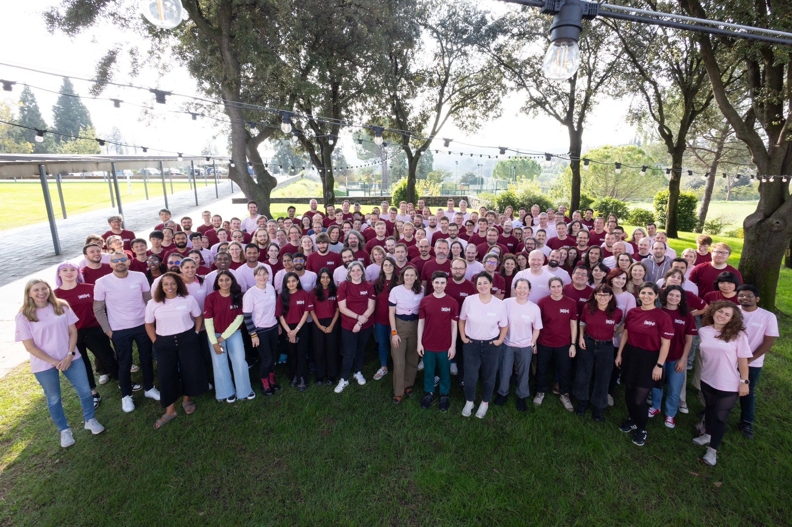
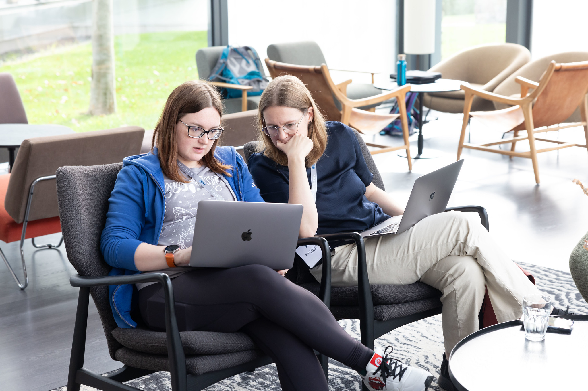

# ELIXIR Estonia Team Participated in the BioHackathon Europe 2024 and Finnish Nordic Computational Biology Conference

ELIXIR Estonia is proud to share our active participation in two significant events during the same week: [BioHackathon Europe 2024](https://biohackathon-europe.org/) in Barcelona and [the Finnish Nordic Computational Biology (NCB) Conference](https://www.nordic-compbio.org/ncb-week) in Helsinki.

<!-- more -->

## Biohackathon Europe 2024

BioHackathon Europe is an annual event that brings together bioinformaticians, researchers, and developers to advance open science, FAIR data practices, and life sciences research. This year’s event, held on the stunning Belloch campus near Barcelona, provides a serene and inspiring setting for over 200 participants to collaborate, innovate, and exchange expertise.

The BioHackathon is a place where experts from different specialities come together and spend most of their time together, and magic happens. People will help each other out, not just in their projects, but also offer help and expertise with other people’s projects. 

### Heleri’s Project: Advancing FAIR Skills

Heleri contributed to Project 29: “ELIXIR FAIR Lesson Plan Handbook: Advancing Researchers’ & Data Stewards’ FAIR Skills”, led by Mijke Jetten and Martijn Kersloot. This project, a continuation of prior efforts, aimed to refine and expand the [FAIR Lesson Plan Handbook](https://elixir-europe-training.github.io/ELIXIR-TrP-FAIR-Converge/). At the BioHackathon, the team made significant progress, including major web page revisions and finalising the lesson plan template.

### Erik’s Project: Enhancing bio.tools with Semantic Literature Mining

Erik participated in Project 16: “Enhancing bio.tools through Semantic Literature Mining”. This project aimed to identify literature-related software mentions, specifically to highlight and link occurrences of tools, databases, and services listed in bio.tools within the full texts of Europe PMC articles. Another goal was to explore co-occurrences and co-mentions (in graph form) and their relationships.

After discussions, the team decided to use methods being developed in Europe PMC, which involve training a Named Entity Recognition (NER) model to identify mentions, followed by entity linking to bio.tools. Consequently, the generation and labelling of training data began during the hackathon. Some challenges include common English words being used as tool names and different tools sharing the same name. The ultimate aim is to integrate the developed code into Europe PMC, enabling adding a bio.tools option in Europe PMC annotations.

There is prior work on identifying software mentions in the literature using machine learning. However, our project had the advantage of working with a fixed list of software (everything in bio.tools). Therefore, Erik started implementing an alternative hand-crafted approach by string-matching all bio.tools entries to articles and iteratively fine-tuning hand-coded algorithms, using additional information from bio.tools such as publications and web links, to reduce errors, primarily false positives. This alternative implementation could help validate the machine learning approach and potentially integrate gained insights as manual code enhancements on top of the machine learning results.

Both Heleri and Erik highlighted the unique blend of productivity and collaboration at the hackathon, emphasising the value of connecting with like-minded experts from across the ELIXIR network and beyond. 

## Finnish Nordic Computational Biology Conference

In the same week, Diana, our training coordinator, attended the Finnish Nordic Computational Biology (NCB) conference at the Helsinki Viikki campus. The two-day event was packed full of interesting presentations, including topics such as computational microscopy (with the potential of virtual staining), FAIRifying toxicogenomics data for chemical safety assessment, research on microelectrode arrays with neurons, machine learning approaches to antibody affinity and many more. 

## Looking Ahead

The dual participation in BioHackathon Europe and the Finnish NCB conference underscores ELIXIR Estonia’s commitment to fostering collaboration, advancing open science, and driving innovation in life sciences research. We look forward to building on these experiences and contributing to similar events in the future.

Stay tuned for updates on these exciting projects and initiatives!
