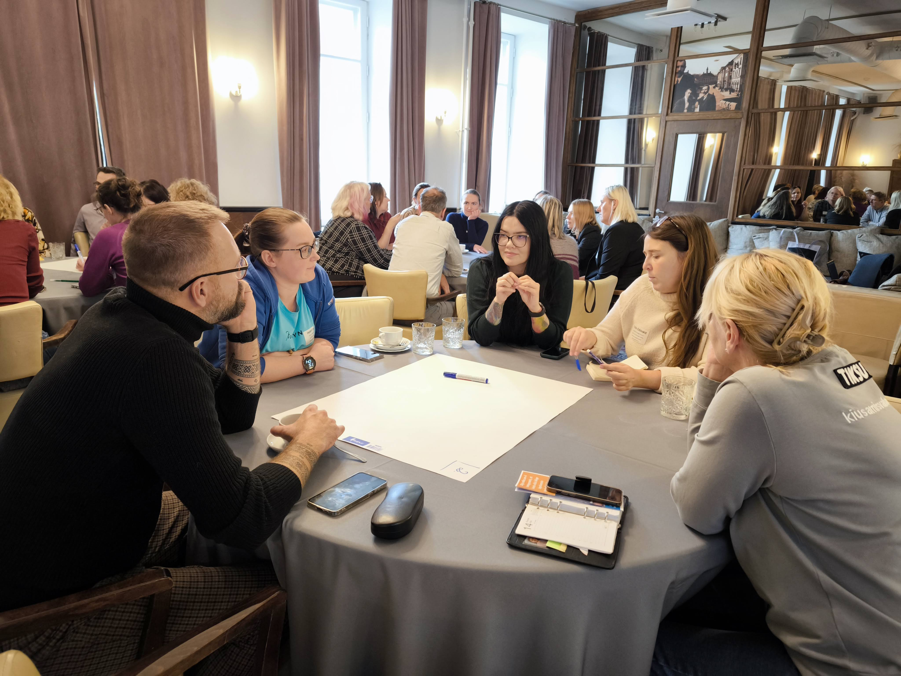

# Citizen Science Seminar Highlights the Need for Collaboration in Estonia

On October 15, citizen science enthusiasts, researchers, and representatives from various institutions gathered in Tartu for a [seminar on advancing citizen science in Estonia](https://miks.ee/harrastusteadus/). The [Estonian Research Council](https://etag.ee/) hosted the event and attracted participants from universities, museums, government agencies, and beyond. The seminar fostered active discussions and collaboration, emphasising the importance of building and maintaining a strong network to support citizen science initiatives in the country.

<!-- more -->

Participants voiced a strong need for more coordinated efforts and institutional support for citizen science in Estonia. Currently, no organisation is responsible for promoting, organising, or managing citizen science initiatives. The seminar underscored this gap, with attendees wishing for a more unified approach to foster and develop citizen science nationwide. 

Many attendees noted a lack of knowledge about each other's work in this area, emphasising the importance of improved communication channels. To respond to this need, a new mailing list, harrastusteadus@list.etag.ee, was established to facilitate ongoing information sharing among citizen science practitioners in Estonia. It is open to anyone interested in promoting and developing citizen science, implementing projects, involving the public in scientific activities, or staying informed. To join, contact riho.kinks@etag.ee. 

This initiative marks a significant step towards creating a more connected and supportive community for citizen science in Estonia.

