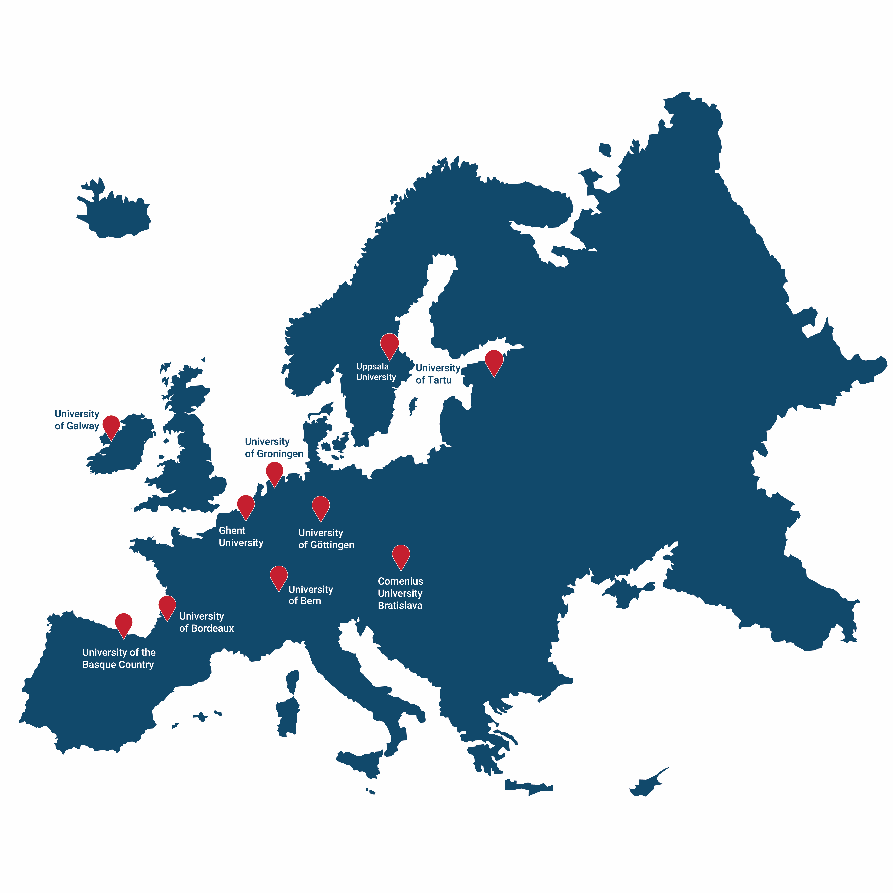

# Diana, ELIXIR Estonia Training coordinator, attended the ENLIGHT Teaching and Learning Conference “Innovation and Creativity in Higher Education”

The fourth [ENLIGHT Teaching and Learning Conference](https://enlight-eu.org/index.php/for-educators/teaching-and-learning-conference), which was held at the University of Tartu from 7 to 9 October 2024, was themed “Innovation and Creativity in Higher Education.” Our training coordinator, Diana, attended the conference to learn about student-oriented teaching methods. 

<!-- more -->

[ENLIGHT](https://enlight-eu.org/index.php) stands for European University Network to promote equitable quality of Life, sustaInability and Global engagement through Higher education Transformation. ENLIGHT is a European University alliance of ten comprehensive, research-intensive universities from ten European countries (Belgium, Estonia, France, Germany, Ireland, Netherlands, Slovakia, Spain, Sweden, and Switzerland), training over 300,000 learners annually and sharing a deep commitment to social responsibility.

The highlight of the conference were the two keynote speakers: Laura-Maija Hero, the Principal Research Scientist at HAMK Edu research unit, who spoke about “Design-based approach in teaching and its connection to foster student creativity and innovation”, and Jaan Aru, the Associate Professor in Computational Neuroscience and Artificial Intelligence at the University of Tartu, who delivered the presentation “Brain learning, creativity and students’ motivation”, in which he discussed how to support creativity and motivation in studying. Keynote talks are available on the [YouTube channel](https://www.youtube.com/@ENLIGHTEU/videos). 

There were 23 workshops, 27 presentations, 9 roundtable topics to discuss, and 35 poster presentations. Some of these happened in parallel, so you could choose the most interesting topic. You can access most of the presentation and workshop slides by visiting the conference's [programme page](https://onlineexpo.com/en/enlight-2024/programme/). Simply click on the desired topic, and when the popup window appears, click on the paperclip icon to download the slides. 

The next teaching and learning conference will take place in 2025 in Uppsala.
More information: [https://enlight-eu.org/index.php](https://enlight-eu.org/index.php) 
