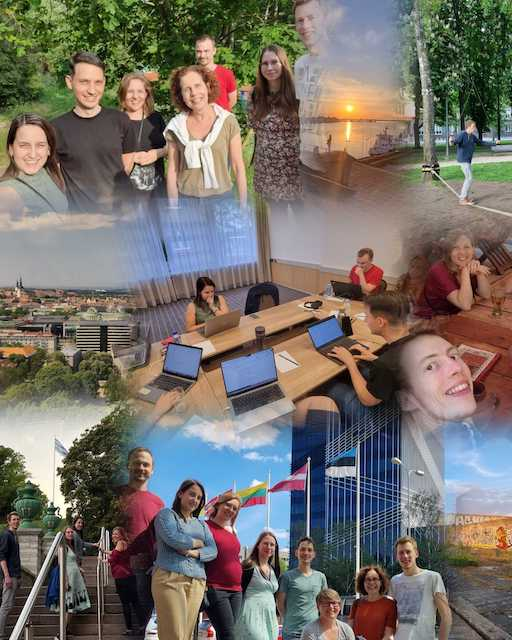

# ELIXIR Estonia participated in Infectious Diseases Toolkit (IDTk) Contentathon 2024

Last week of May [BY-COVID Project](https://by-covid.org/) partners from [SciLifeLab](https://www.scilifelab.se/data/), [The SIB Swiss Institute of Bioinformatics](https://www.sib.swiss/), [BBMRI-ERIC](https://www.bbmri-eric.eu/), [ELIXIR Belgium](https://www.elixir-belgium.org/) and ELIXIR Estonia gathered to Tallinn to advance the [Infectious Diseases Toolkit](https://www.infectious-diseases-toolkit.org/) content. We published 5! new pages and a few more will be released soon.

<!-- more -->

* The new [ELSI page](https://www.infectious-diseases-toolkit.org/ethical-legal-and-social-issues/) captures general information about Ethical, Legal, and Social Issues.
* What should be kept in mind when doing quality control for socioeconomics data can be found [in this guide](https://www.infectious-diseases-toolkit.org/quality-control/socioeconomic-data)
* The [showcase of using the ENA data submission toolbox for SARS-CoV-2 data](https://www.infectious-diseases-toolkit.org/showcase/ena-data-submission-toolbox) provides an overview of extremely useful set of tools that allowed data providers load thousands of sequencing results to ENA during the pandemic.
* Another showcase highlights the [lessons learned on how to run a prevalence study based on the 4-years experience in Estonia](https://infectious-diseases-toolkit.org/showcase/estonian-prevalence-study).
* The most colourful page so far in IDTk captures general information about best practices in communicating data, specifically using [data visualisations](https://www.infectious-diseases-toolkit.org/data-communication/).

We are very grateful for the contributors who wrote the initial texts and shared their lessons from the last 4 years. Special thanks go to our editors who couldn't make it to Tallinn but participated from distance.

Thank you BYCOVID for bringing us together, so we could collect and share all the knowhow we wish we had at the brink of the SARS-CoV-2 pandemic hit us in 2020.

