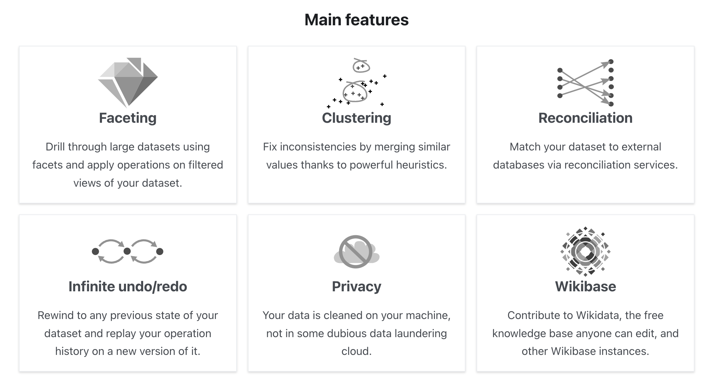

The practical workshop on cleaning your messy data with [OpenRefine software](https://openrefine.org/).

First, we will cover spreadsheet best practices. Then, we will put that knowledge into practice with OpenRefine. This course will explore the depths of OpenRefine software and see what it can offer. This will include cleaning the data in bigger batches and unifying the data in one sweep (transforms and expressions). Additionally, we will introduce the possibility of downloading additional data from other databases and different extensions OpenRefine software has.

<!-- more -->

