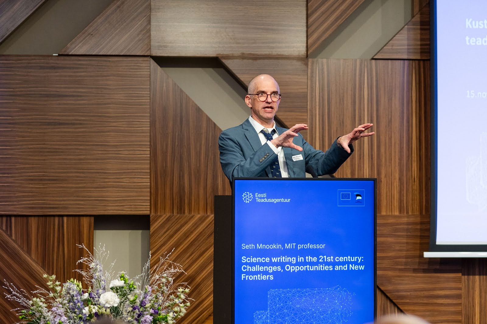

# Heleri and Diana Participated in the Estonian Research Council Event on Science Communication

ELIXIR Estonia is delighted to share that our Data Managers, Heleri and Diana, recently attended the [Estonian Research Council’s](https://etag.ee/) event, [“Teaduskommunikatsiooni järelkasv: kust tulevad ja kuhu kaovad teaduskommunikaatorid?”](https://etag.ee/tegevused/teaduskommunikatsioon/teaduskommunikatsiooni-konverentsid/teaduskommunikatsiooni-konverents-2024/) (“The Future of Science Communication: Where Do Communicators Come From and Where Do They Go?”).

<!-- more -->

The event provided an excellent platform to explore science communicators' evolution and discuss how to enhance the public's engagement with science.

Highlights of the event included:

A keynote session, “Science Writing in the 21st Century: Challenges, Opportunities, and New Frontiers”, by Seth Mnookin, professor at the Massachusetts Institute of Technology. Mnookin emphasised the art of making complex topics accessible without losing (too much) accuracy and the need to understand and connect with diverse audiences using engaging narratives.

Erik Abner, geneticist from the University of Tartu, shared his journey from scientist to active science communicator during the COVID-19 pandemic. He stressed the value of public engagement and building resilience against criticism in the digital age.

Insights from Annely Allik, head of the Science Communication Department at ERC, discussed the role of marketing principles in effective communication. She highlighted the importance of passion and understanding your audience to truly connect with them.

An absolute highlight of the event was the inspiring performance by Aare Baumer, the Head of Science and Development at the Energy Discovery Centre, the 2023 Lifetime Achievement Award for the Popularization of Estonian Science. His heartfelt, motivational and funny address left a lasting impression on all attendees.

Interested in learning more?

📄 [Information about the conference](https://etag.ee/tegevused/teaduskommunikatsioon/teaduskommunikatsiooni-konverentsid/teaduskommunikatsiooni-konverents-2024/) 

📹 [Video of the conference](https://www.youtube.com/watch?v=9dB2d44NQPA) 

