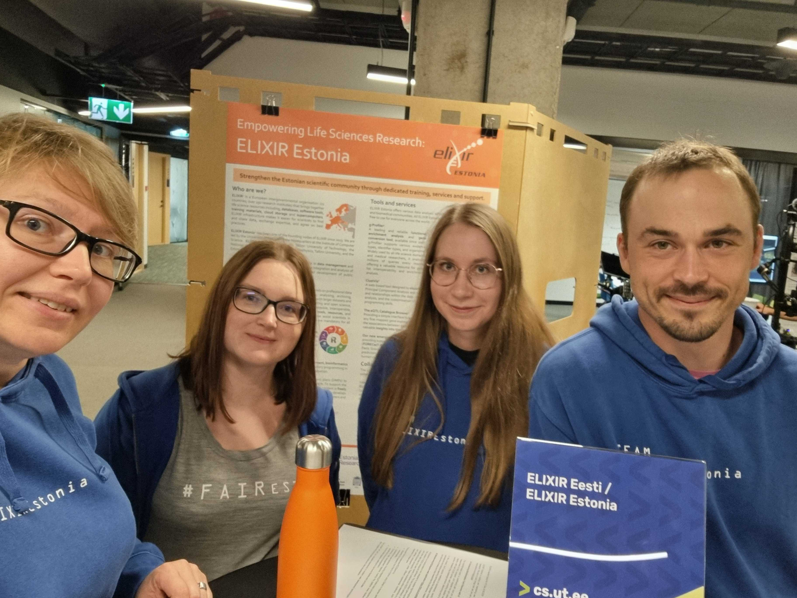

# ELIXIR Estonia participated in UniTartuCS Day

The UniTartuCS Day, held annually in September, offers students a unique opportunity to connect with researchers and lecturers, explore thesis topics, and establish ties with research groups. ELIXIR Estonia participated in the event with a poster presentation, and our Head of Node, Hedi Peterson, proposed four possible thesis topics applicable to both Bachelor's and Master's students. For more information, we encourage you to reach out to us.

<!-- more -->
Poster is available for viewing in Zenodo repository: https://doi.org/10.5281/zenodo.13847963

Below is a picture of our representative group (from left: Hedi Peterson, Heleri Inno, Diana Pilvar, Uku Raudvere).

{width=500 height=400}
