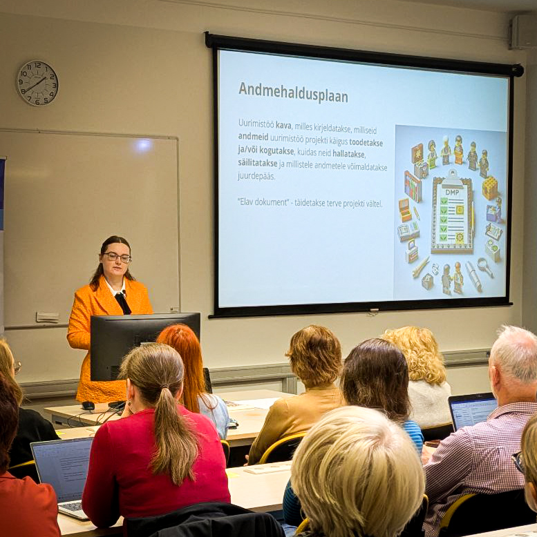

# ELIXIR Estonia Contributes to the University of Tartu Data Management and Open Science Network

On May 14th, the University of Tartu's Data Management and Open Science competence network held its [second training session](https://utlib.ut.ee/en/news/kick-trainings-held-data-management-and-open-science-competence-network), organised by the [University of Tartu Library](https://utlib.ut.ee/en). ELIXIR Estonia was proud to contribute to this initiative that supports the advancement of data management and open science across the university.

<!-- more -->

Our Data Manager, Heleri, and Training Coordinator, Diana, took part in the event and contributed to the training alongside Liisi Lembinen and Tiiu Tarkpea from the University of Tartu Library. Together, they shared practical insights and experiences with the network members.

We thank Liisi Lembinen for organising this important training and inviting ELIXIR Estonia to participate. Collaborations like this are essential for strengthening Estonia’s research data management and open science practices.

We look forward to continued collaboration and the growing impact of the University of Tartu Data Management and Open Science competence network.

Our presentation is available [here](https://doi.org/10.5281/zenodo.15422659)
