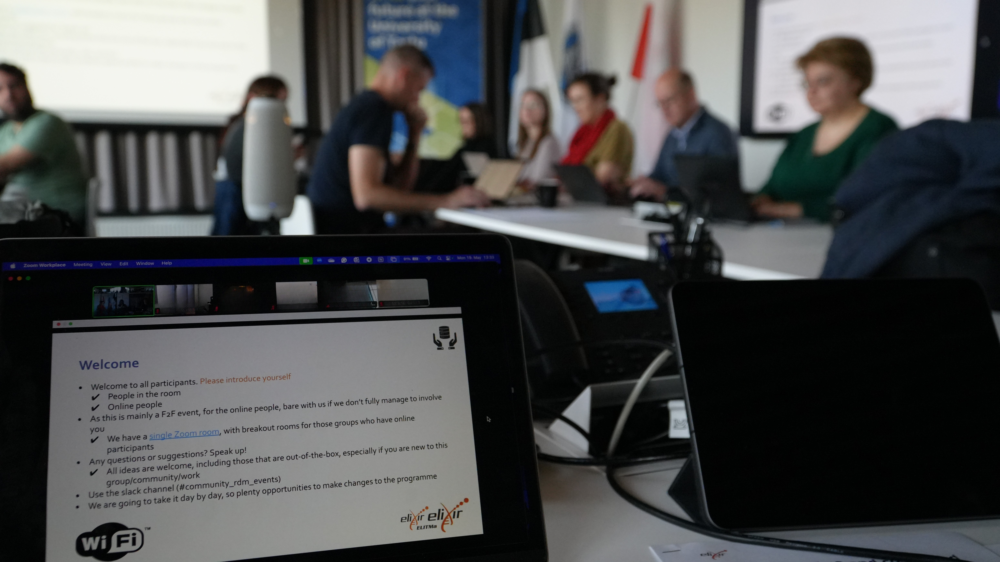

# ELIXIR Estonia hosted the ELIXIR ELITMa module 2 and Interoperability Platform meeting in Tartu

In May, the [University of Tartu Institute of Computer Science](https://cs.ut.ee/en ) and [ELIXIR Estonia](https://elixir.ut.ee/) had the pleasure of hosting a productive [ELIXIR](https://elixir-europe.org/) Week, featuring both the [ELITMa](https://elixir-europe.org/platforms/training/elitma) and a co-located [Interoperability Platform](https://elixir-europe.org/platforms/interoperability) workshop. From May 19th to 22nd, data management experts and colleagues from 11 ELIXIR Nodes across Europe gathered at the Institute of Computer Science to focus on key research data management and interoperability areas.

<!-- more -->

The ELITMa (ELIXIR Training Programme in Management) Module 2 Node Data Management Strategy meeting brought together Node representatives to strategically address strengthening Node-level data management approaches. Through a series of hands-on exercises and collaborative discussions, participants shared best practices and continued to develop the Node Maturity Model. All this work will be published as a research article alongside the toolkit. 

Following the ELITMa module, the co-located ELIXIR Interoperability Platform workshop provided a dedicated time to refine the ELIXIR’s [FAIRification framework](https://faircookbook.elixir-europe.org/content/recipes/introduction/fairification-process.html). This allowed participants to continue the work from the December 2024 Luxembourg event.

ELIXIR Estonia, based at the University of Tartu, was honoured to host these important ELIXIR events. We are grateful to the Institute of Computer Science for providing the excellent venue and support throughout the week. "It was fantastic to host colleagues from across the ELIXIR Nodes here in Tartu for such a focused and collaborative week," commented Heleri, ELIXIR Estonia Data Manager and one of the event organisers. 

Discussions throughout the week were highly insightful and productive, highlighting the shared commitment to building a more integrated and effective European research data ecosystem.
