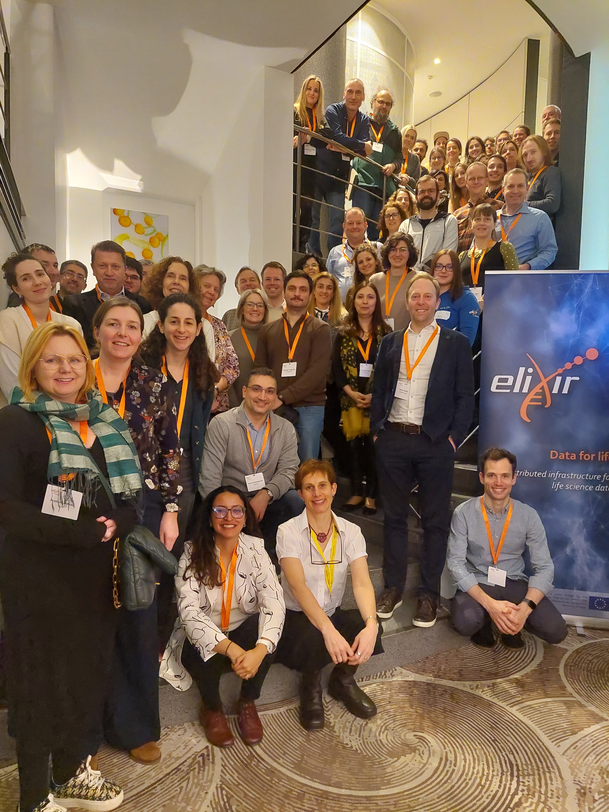
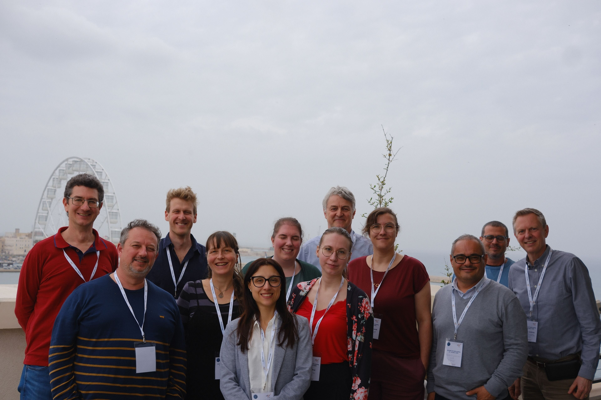
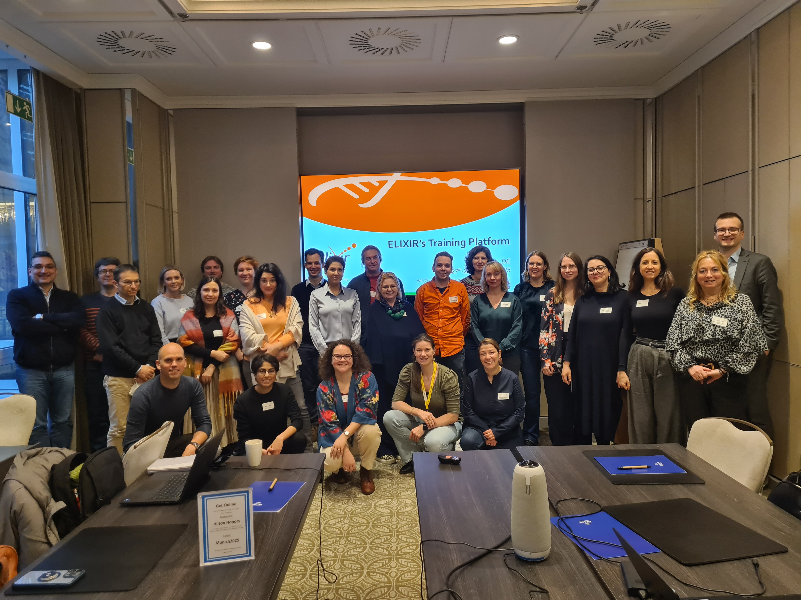
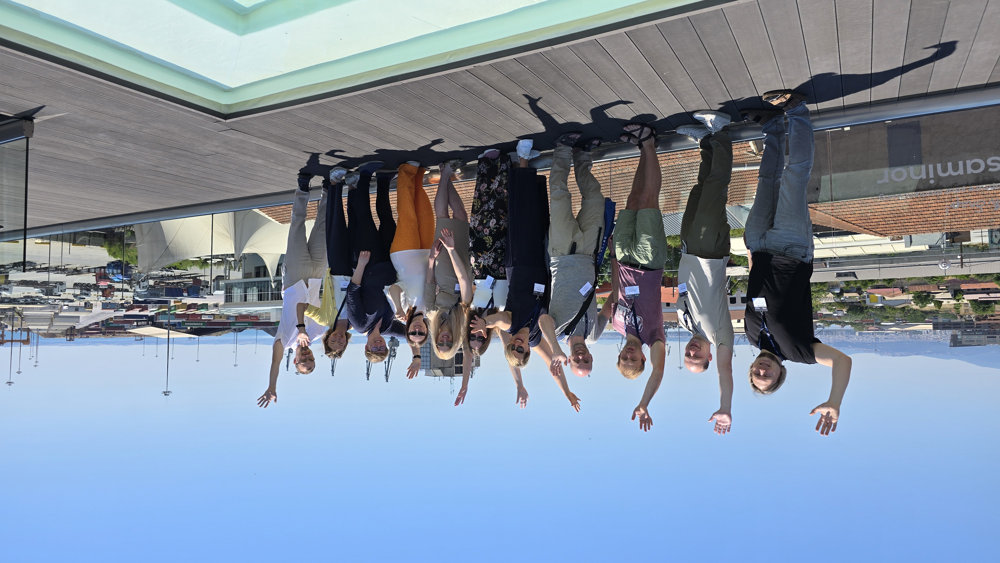
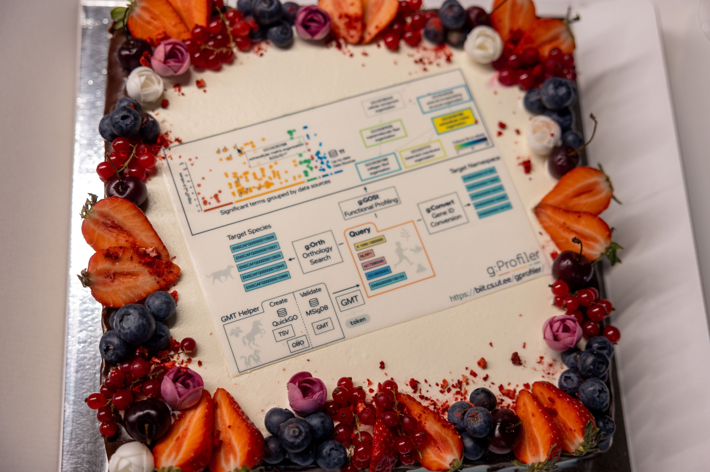

# ELIXIR Estonia’s January to June 2025 Highlights

The first half of 2025 has shown how ELIXIR Estonia combines international collaboration, national community-building, and innovative training to support researchers. With initiatives in citizen science, data management network, and skill development, the team is contributing to the foundation for a strong, sustainable research data ecosystem in Estonia.

<!-- more -->

## Sharing Knowledge and Best Practices

  - Citizen Science Seminar: Data Protection (7 March, Tartu) – Diana participated in this Estonian Research Council-organised event, [delivering a presentation](https://www.youtube.com/watch?v=_bnnovebxMY&t=4425s ) on data horror stories, using cautionary examples to highlight why good data management practices are essential for research. [More info](https://miks.ee/harrastusteaduse-seminar-andmekaitse/)
  - “The Transformative Potential of Citizen Science in Environmental Decision-Making” Seminar (1 April, Tartu) – Heleri participated in the seminar, introducing the current status of environmental citizen science in Estonia and encouraging participants to brainstorm how the project “Transformative Impact of Citizen Science on Environmental Governance: A Systematic Analysis of Perspectives and Pathways” (2025–2029), funded by the Estonian Research Council, can contribute to addressing topical issues. [More info](https://www.emu.ee/sundmused/harrastusteadus-keskkonnaotsuste-mojutajana-olukord-ja-valjavaade)
  - University of Tartu Data Management and Open Science Network Training Event (14 May, Tartu) – Heleri and Diana [presented](https://doi.org/10.5281/zenodo.15422659) alongside Liisi Lembinen and Tiiu Tarkpea from the [University of Tartu Library](https://utlib.ut.ee/en). Heleri introduced key data management practices, while Diana highlighted resources and initiatives from other EU countries. [Read more](https://elixir.ut.ee/news/2025/05/16/DM_UT_Training/)

  - Citizen Science Discussion Day: We’re Looking for Spunk! (11 June, Tartu) – Heleri joined this event organised by the Estonian Research Council to discuss current challenges and opportunities in citizen science. [More info](Citizen Science Discussion Day: We’re Looking for Spunk! (11 June, Tartu) – Heleri joined this event organised by the Estonian Research Council to discuss current challenges and opportunities in citizen science. More info)

## Strengthening International Collaborations

  - STEERS General Assembly and WP4 meetings (27–29 January, Brussels) - During the several days, there was an overview of the [ELIXIR STEERS](https://elixir-europe.org/about-us/how-funded/eu-projects/steers) project work and collaboration with other Work Packages to strengthen project outcomes.

  
  - ELIXIR DATAREX WP3 meeting (24-26 March, Bari) - Diana helped to expand the [Research Data Management Maturity Model](https://registry.ds-wizard.org/knowledge-models/datarex:RDM-MM:0.1.2) and align it with the [Data Stewardship Handbook](https://elixir-uk.github.io/elixir-ds-handbook/). The work was done in groups, where they successfully transformed simple keywords into a comprehensive set of indicators, each defined by three to five maturity levels. Alongside this, they also established the applicability of each indicator and developed detailed descriptions, along with specific guidance for the Data Stewardship Handbook on how to achieve these goals.

  - ELIXIR Training Platform meeting (27-28 March, Munich) - Diana, our Training Coordinator, joined the [ELIXIR Training Platform](https://elixir-europe.org/platforms/training) yearly meeting, where the first half of the meeting was dedicated to reviewing progress across the 2024-2026 work packages, including updates to the [Training Metrics Database](https://tmd.elixir-europe.org/world-map), the development of the [Training Lifecycle in SPLASH](https://elixir-europe-training.github.io/ELIXIR-Training-SPLASH/) and the second half on focusing on setting goals for 2027-2028.

  

  - Hosting ELIXIR ELITMa module 2 and Interoperability Platform meeting (19-22 May, Tartu) - ELIXIR Estonia welcomed around 30 colleagues from across Europe for two events: the [ELITMa](https://elixir-europe.org/platforms/training/elitma) RDM Strategy Meeting and the [Interoperability Platform](https://elixir-europe.org/platforms/interoperability) Meeting. Discussions focused on the RDM Maturity Model and the Data Steward Handbook, supporting shared resources for the network. [Read more](https://elixir.ut.ee/news/2025/06/30/ELITMa_May2025/)

  

  - ELIXIR All Hands meeting (2-5 June, Thessaloniki) - ELIXIR Estonia presented a [poster](https://doi.org/10.5281/zenodo.15656761) on its activities and hosted an online All Hands Bingo, adding a fun, interactive element to the community gathering.

## Celebrating Achievements

  - g:Profiler Milestone: 2025 marked 18 years since the launch of [g:Profiler](https://biit.cs.ut.ee/gprofiler/gost), a web server for functional enrichment analysis. The widely used tool reached an impressive 10,000 overall citations, including 5,000 for the landmark 2019 article. [Read more](https://elixir.ut.ee/news/2025/04/08/g%3AProfiler_5K/)

## Publications

  - A new study [analysing SARS-CoV-2 lineage dynamics in Estonia](https://bit.ly/40mzcOG) was published in PLOS One, revealing differences in regional spread, travel-related cases, and diversity. 

This work was part of the Estonian [KoroGenoEST project](https://kliinilinemeditsiin.ut.ee/et/sisu/eesti-sars-cov-2-taisgenoomide-jarjestamine-ja-analuus-korogeno-est-1est-2est-3), in which ELIXIR Estonia contributed during the COVID-19 pandemic.

## Industry Collaboration

Ongoing collaboration with [Protobios](https://protobios.com/) regarding genome analysis and modelling. 

## Expanding Training Opportunities

Training continued to be a cornerstone of ELIXIR Estonia’s work. In early 2025, we introduced several new courses for the Estonian research community, including:

  - [Getting organised with Notion](https://elixir.ut.ee/news/2025/01/02/Notion_22-01/)
  - [Introduction to Exploratory Data Analysis (EDA) with R](https://elixir.ut.ee/news/2025/01/02/Exploratory_data_analysis/)
  - [Introduction to Statistics with R](https://elixir.ut.ee/news/2025/01/13/Intro_statistics_R_18-02/)
  - [Prompting for Large Language Models (internal course for the University of Tartu School of Economics and Business Administration)](https://elixir.ut.ee/news/2024/04/03/viiba_koostamine_majandusteaduskond/)

In April, Diana, Marilin, and Priit were invited to Prague by [ELIXIR CZ](https://www.elixir-czech.cz/) to deliver a [week of bioinformatics training](https://www.elixir-czech.cz/events/statistics-for-life-sciences-in-r-course), covering R statistics, UNIX, data visualisation, and more. It was a wonderful opportunity to share knowledge and strengthen connections with ELIXIR CZ colleagues.

In April 2025, our training coordinator Diana Pilvar was invited to be a guest lecturer for the [Data Steward curriculum](https://rdm.univie.ac.at/data-stewards-at-the-university/become-a-data-steward/) at the [University of Vienna](https://www.univie.ac.at/en/). She was part of the [“Module 3: FAIR Research Data in the Life Cycle”](https://www.postgraduatecenter.at/en/programs/communication-media/data-steward/content-and-objectives/), giving the lecture [“Data Stewardship in the Natural and Life Sciences”](https://doi.org/10.5281/zenodo.15423435). She highlighted different useful resources, talked about the specificity of data steward work in life sciences and introduced different data steward communities within Europe. 

These courses support ELIXIR Estonia’s long-term training strategy, equipping researchers with both foundational and advanced skills in bioinformatics, data management, analysis, and research organisation.

--------

*This text was edited with the help of AI (ChatGPT 5.0, developed by OpenAI).*
