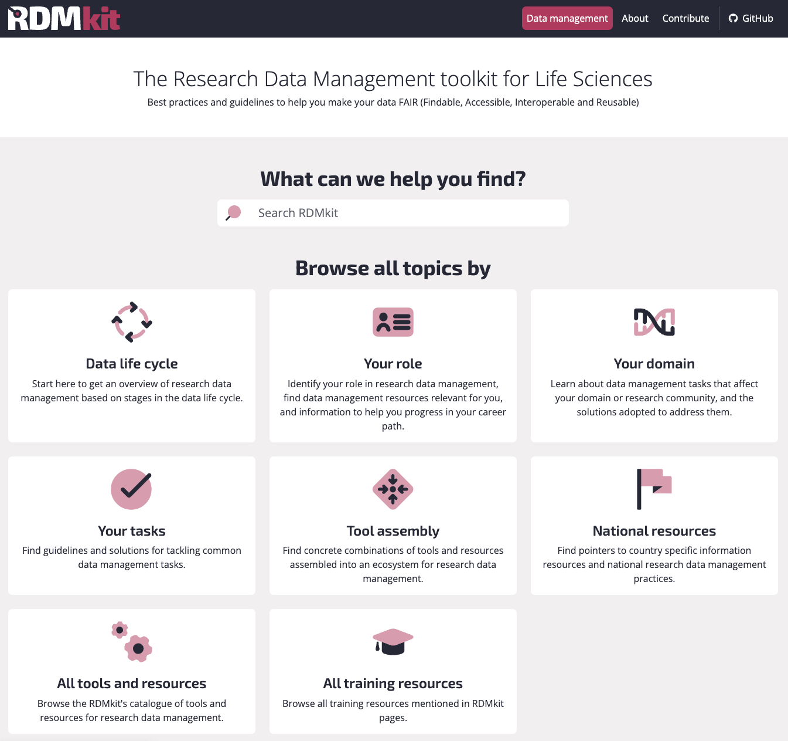
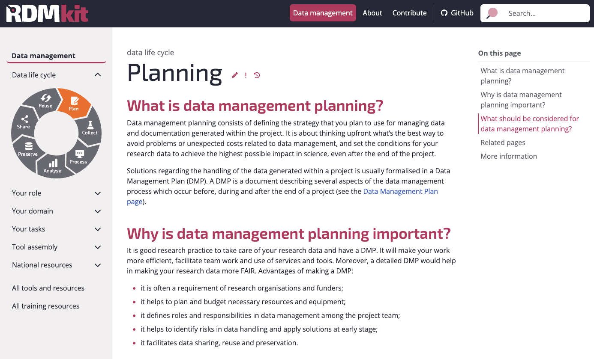
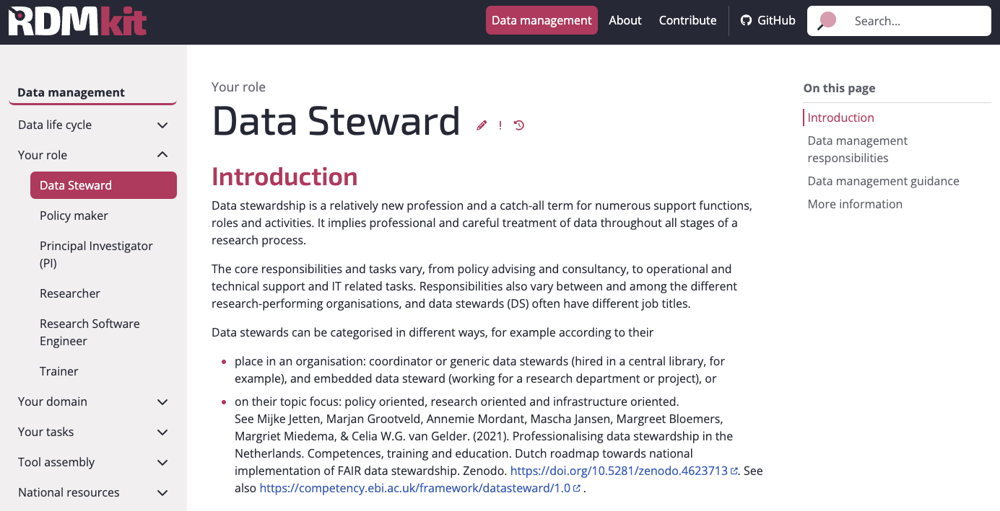
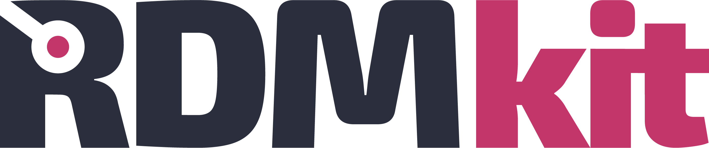

# RDMkit: Guiding Life Scientists in Research Data Management

ELIXIR Estonia is proud to showcase the [Research Data Management Kit (RDMkit)](https://rdmkit.elixir-europe.org/), a community-led knowledge resource for life sciences that helps researchers and data stewards navigate the complexities of managing research data. Developed through the [ELIXIR CONVERGE project](https://elixir-europe.org/about-us/how-funded/eu-projects/converge ) and supported by the European Union’s Horizon 2020 programme, the RDMkit provides guidance on Research Data management that aligns with FAIR principles, ensuring data is findable, accessible, interoperable, and reusable.

<!-- more -->

The RDMkit serves as a gateway to a wealth of RDM knowledge, including best-practice guidelines, domain-specific solutions, curated tool assemblies, and training resources. It supports researchers at all stages of the research data lifecycle, helping to improve data quality, reproducibility, and accessibility. Its open infrastructure allows organisations to create their own guidelines using the RDMkit as a blueprint.

A recent [publication](https://doi.org/10.1016/j.patter.2025.101345) in the Cell Press open-access journal Patterns tells the story of how the RDMkit was developed and how it has grown through community contributions. The article emphasises its role in standardising RDM practices, facilitating collaboration, and enabling sustainable data management strategies across life science domains. As of August 28, 2025, 228 contributors have worked on RDMkit, creating 134 pages on data management. The toolkit includes references to 575 different tools and resources.

In ELIXIR Estonia, Priit Adler (Research Fellow of Bioinformatics) participated in the beginning stages of the project, contributing to the role descriptions, while Heleri Inno (Data Manager) continued to develop the resource during the CONVERGE project, and Diana Pilvar (Training Coordinator) contributed as part of the editorial board.

The RDMkit is openly available, and anyone can contribute knowledge to strengthen life science data management practices: https://rdmkit.elixir-europe.org/

