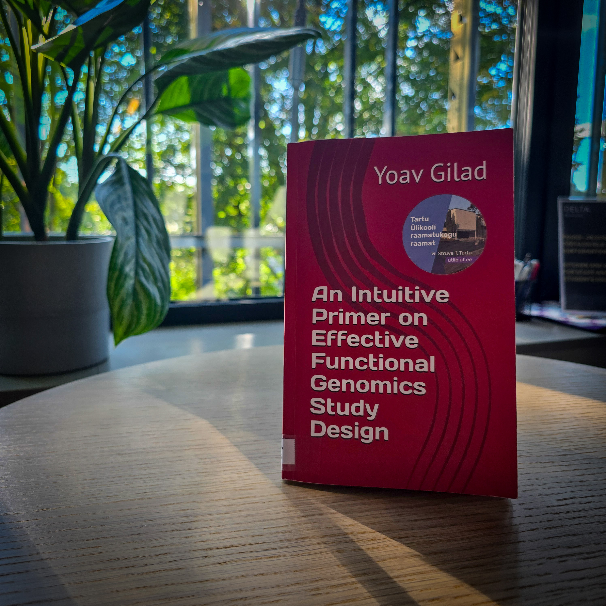

# Review of An Intuitive Primer of Effective Genomics Study Design

[“*An Intuitive Primer on Effective Functional Genomics Study Design*”](https://www.amazon.com/Intuitive-Primer-Effective-Functional-Genomics/dp/B0DT9JLT6S/ref=sr_1_1?crid=5BI8RC5JVU7G&dib=eyJ2IjoiMSJ9.H120vigtXK6rCO9fMttISA.selz7w3qgD8ZD-Ijrx993KubvqGOUcg6QLVgb0saoZw&dib_tag=se&keywords=An+Intuitive+Primer+on+Effective+Functional+Genomics+Study+Design&qid=1760528768&sprefix=an+intuitive+primer+on+effective+functional+genomics+study+design%2Caps%2C171&sr=8-1) by [Yoav Gilad](https://www.linkedin.com/in/yoav-gilad-3a5589130/) provides a clear and accessible guide to the principles of effective functional genomics study design. Instead of prescribing fixed protocols, it encourages readers to think critically about their choices. For students, teachers, and researchers entering the field, it is an insightful and practical resource that I highly recommend.

<!-- more -->

On X, I came across a [post](https://x.com/Y_Gilad/status/1877562179185992053) by Yoav Gilad, announcing his new book. While functional genomics was slightly outside my research field during my university studies (I concentrated on viruses and evolution for both my Bachelor’s and Master's degrees in Genetic Engineering), many of my close friends worked in this area. I decided to read the primer to see if it might be helpful for students, teachers, and researchers in Estonia (but also in the rest of the world). In other words, I wished to act as a vetting machine. After reading it, I can conclude that it is a good educational resource. I particularly liked how it gradually builds from simple study designs toward more complex considerations, making the material approachable while still reflecting the different analyses in functional genomics research.

## What is the book?

“*An Intuitive Primer of Effective Genomics Study Design*” by Yoav Gilad, Dean for Biomedical and Health Informatics at the University of Chicago, was published in 2025. Instead of walking readers through fixed methods, it encourages them to develop the mindset and awareness needed to make sound design decisions. It is simple in design but ambitious in scope, aiming to guide new researchers in their project approach.

## What does it cover (and what it does not)?

The book begins by carefully clarifying its scope.
  
  - Why it matters: in most traditional biology experiments, study design is built around testing a specific hypothesis. In functional genomics, however, researchers must be prepared for unexpected results that emerge from high-dimensional datasets. This difference makes careful design all the more important.

  - Who it is for: upper-level undergraduate biology students and first-year graduate students. Although it is also suitable for people teaching functional genomics study design and researchers working/collaborating in this field. 
  
  - What it is not: no classic study design, detailed protocols, or sample size calculations.

To support this, the text avoids formal mathematical treatments and instead focuses on cultivating an intuitive understanding of principles that lead to robust and interpretable results.

## Structure of the primer

The book is divided into five design categories:

1. What to expect from genomics technologies
2. Biological versus technical replicates
3. Managing complexities in study design
4. Batch effects and the importance of metadata
5. Choices and consequences

The discussion moves from relatively simple examples to increasingly complex scenarios, highlighting common pitfalls and possible solutions each time. The final section brings these lessons together by presenting real studies in which poor design led to misleading conclusions, such as mistaking association for causation.

## Review

>“*Today, functional genomics studies are often regarded as lacking novel mechanistic insight unless they provide an understanding of specific molecular events, such as how particular transcription factors or protein complexes drive specific gene changes and, ultimately, specific cellular outcomes. This is why I typically avoid discussing mechanisms when defining the goals of a functional genomics study. Frankly, I’m not sure I know what “mechanisms” mean exactly, and as a result, it’s not a useful tool for setting clear objectives. Instead, I prefer to describe the goals of a study, or expected results, in terms of correlation and causation.*” “*An Intuitive Primer on Effective Functional Genomics Study Design*” by Yoav Gilad, published 2025, pages 28-29. 

One of the book's greatest strengths is its writing style. The text is clear, direct, and approachable, even when discussing advanced concepts. It often feels like having a professor in the room, patiently guiding you step by step and pointing out the trade-offs inherent in each design choice. The inclusion of real-world examples at the end of the book further reinforces why careful planning is not just academic but essential for reliable research outcomes.

There are, however, a few drawbacks. The figures, while functional, are not of the highest quality and could be improved for clarity. The main text might also have benefited from more personal stories or case studies woven throughout, rather than saving them mainly for the final section. Finally, Gilad’s personal opinions on study design are strongly present. Some readers may appreciate this perspective, while others prefer a more neutral tone.

In conclusion:

>“*Good study design is not optional. It is the foundation on which all subsequent analysis and interpretations rest. A flawed design cannot be fixed after the fact, and no amount of data manipulation can salvage a study that has failed to address the fundamental principles of experimental rigor.*”

This message captures the spirit of the book. For anyone new to functional genomics (or teaching it), this makes it a valuable companion, one that is well worth recommending and sharing.
