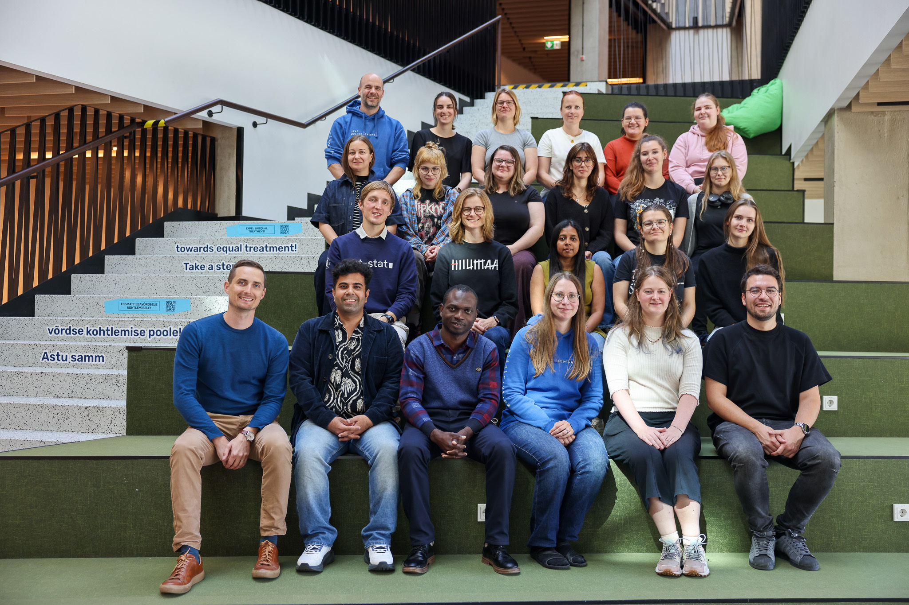

# Continued collaboration with ELIXIR-CZ

Estonia and the Czech Republic work well together at every level; as ELIXIR Nodes, as universities and as countries, and this year has shown all three. This week, it was our turn to host: after two springs of Estonian trainers teaching in Prague, ELIXIR-CZ trainers came to Tartu.

<!-- more -->

Our knowledge exchange story began in Prague. In 2025, ELIXIR Estonia trainers Diana Pilvar, Priit Adler, and Marilin Moor taught in ELIXIR-CZ's [Statistics for Life Sciences in R](https://www.elixir-czech.cz/events/statistics-for-life-sciences-in-r-course) course, and in May 2026, they returned to teach [Python Basics](https://www.elixir-czech.cz/events/python-basics-05-2026). Their hands-on sessions have covered topics including Python, R, data visualisation, Shell, g:Profiler and statistics.

This September, the direction reversed. From 7 to 10 September, Jan Kubovčiak, Lucie Pfeiferová and Vojtěch Melichar of ELIXIR-CZ taught a four-day [scRNA-seq Data Analysis](https://elixir.ut.ee/news/2026/06/07/scRNA-seq_Data_Analysis/ ) course in Tartu. No comparable training has been available in Estonia recently. We are grateful to Jan, Lucie and Vojtěch for bringing their expertise to our community.

> "The practical exercises were very well constructed, the step-by-step instructions were great." — Course participant

Exchanges like this are, for us, among the best things about belonging to a pan-European research infrastructure. ELIXIR connects people and expertise across borders, giving our community the chance to learn from and work with colleagues in other countries. It is also a reminder of why research infrastructures that provide open training and services need sustained support and funding.

## Cooperation at the university and country level

Our partnership with the Laboratory of Genomics and Bioinformatics at the Institute of Molecular Genetics of the Czech Academy of Sciences has also been recognised well beyond the training room. In May, Czech President Petr Pavel and Masaryk University Rector Martin Bareš visited the University of Tartu as part of the [Czech presidential state visit](https://ut.ee/en/news/president-czech-republic-and-rector-masaryk-university-visited-university-tartu ). The two universities used the occasion to sign a cooperation agreement covering student exchange, joint research projects and wider academic contacts, among other areas. Our Head of Node, Professor Hedi Peterson, and our lecturers were invited to the reception held during the visit — a welcome acknowledgement of the ELIXIR Estonia–ELIXIR-CZ collaboration.

> "These collaborations bring new expertise and opportunities to our research community, while strengthening ELIXIR Estonia's connections within the wider ELIXIR network. Sharing knowledge across Nodes helps us build lasting partnerships and offer expertise we could not develop alone." Professor Hedi Peterson, Head of Node, ELIXIR Estonia

What began as a few courses in Prague has grown into a lasting partnership between our two Nodes, mirrored by close ties between our universities and our countries. That is exactly what ELIXIR makes possible: connections that grow into partnerships and benefit both communities. We look forward to welcoming a Czech colleague to Tartu again early next year.
