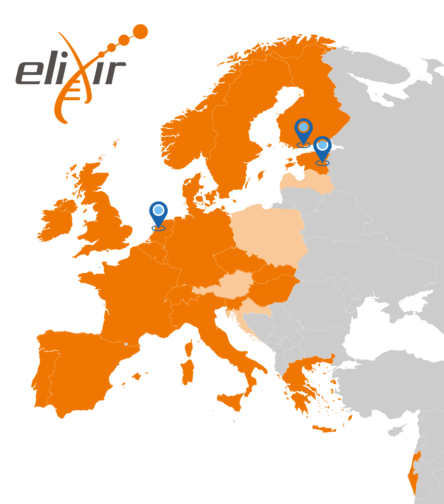

# ELEVATE-DM: Strengthening Data Stewardship Across Europe

Estonia is one of Europe’s most digitally advanced countries. From X-Road to nationally coordinated digital services, we have built an ecosystem that makes sharing and using information remarkably efficient. But strong digital infrastructure alone does not create strong research data management.

As research becomes increasingly collaborative and data-intensive, researchers need more than technology - they need clear guidance, institutional support, professional expertise, and communities that help them manage data throughout its lifecycle. That is exactly what ELEVATE-DM aims to strengthen.

<!-- more -->

We are happy to announce that “Elevating data management for excellence, evidence, and sustainable impact” (**ELEVATE-DM**) Twinning grant has been selected for funding. Led by [the University of Tartu](https://ut.ee/en), home of [ELIXIR Estonia](https://elixir.ut.ee/), ELEVATE-DM will build research data management capacity in Estonia while drawing on the expertise of our Finnish and Dutch [ELIXIR](https://elixir-europe.org/) partners to create lasting impact across Europe.

**"Being part of ELIXIR Europe gave us the initial knowledge and the partners to develop data management in Estonia. Working on it daily has shown us how much more we have to do. With ELEVATE-DM and the experience our partners in Finland and the Netherlands bring, we can now reach the next level, one where good data management is something researchers can rely on, not something they have to solve alone."** Professor Hedi Peterson, the coordinator of ELEVATE-DM at the University of Tartu

## Built on years of ELIXIR collaboration

This partnership is built on a strong foundation established through ELIXIR Europe. Over years of close collaboration within the ELIXIR [Research Data Management community](https://elixir-europe.org/communities/research-data-management), key personnel across all three organisations have developed deep professional relationships and trust. ELEVATE-DM leverages these existing connections, translating shared network knowledge into actionable, institutional-level transformation.

ELEVATE-DM brings together three leading organisations. Led by the University of Tartu, with ELIXIR Estonia as the main driving force, the project collaborates with two European partners: [Health-RI](https://www.health-ri.nl/en ), the Netherlands Health and Life Sciences research infrastructure and home of [ELIXIR Netherlands](https://www.health-ri.nl/en/elixir ) personnel, and [CSC, IT Center for Science](https://csc.fi/en/), led by [ELIXIR Finland](https://www.elixir-finland.org/en/frontpage/) personnel.

**"We are excited to join the ELEVATE-DM project to uplift the research data management capabilities and professionalise the work of data managers. With the ELIXIR Research Data Management community and our ELIXIR colleagues from Estonia and the Netherlands, we look forward to further advancing the professional research data management community in Europe."** Riku Riski, ELIXIR Finland Node Coordinator 

## Project Objectives: Transforming the RDM Landscape

While the primary mission of ELEVATE-DM is to build institutional capacity for RDM and professional data stewardship at the University of Tartu, with [the Institute of Computer Science](https://cs.ut.ee/en) serving as our main testing site, the project’s vision extends far beyond that. ELEVATE-DM aims to strengthen the entire Estonian research ecosystem while producing open frameworks and learning materials that others can adapt internationally.

Over the coming years, the project will focus on three key areas: 

  - **Professionalising Data Stewardship:** Establishing structured learning pathways, micro-credentials, and active Communities of Practice.
  - **Bridging Sectors:** Expanding RDM practices beyond academia into the public and private sectors.
  - **Building the Business Case for RDM:** Conducting research into the costs and economic value of well-managed data to provide solid evidence for sustained institutional and national investment.

**“In the Netherlands, we have learned that professionalising data stewardship also means creating clearer career paths and job profiles and recognising that researchers and data stewards are two sides of the same coin. Working with research funders to strengthen the recognition and support of data stewardship in research has been an important part of that. ELEVATE-DM gives us the opportunity to share these experiences and learn from how Estonia and Finland address the same challenges.”** Mijke Jetten, FAIR Data Lead & Community Manager Data Stewardship, Health RI / ELIXIR Netherlands

Rather than treating data management as a compliance exercise, ELEVATE-DM aims to make it an integrated part of excellent research. 

**"Researchers rarely ask for help with data management in those words. They ask how to share a dataset with a collaborator, or what to write in a grant application, or where files from three years ago have gone. Our job is to make sure there are clear best practices, reliable guidance, and institutional support that help researchers find the right answer, and ELEVATE-DM gives us the opportunity to build exactly that."** Diana Pilvar, data manager, University of Tartu

## Mutual Value and Shared Expertise

Each partner brings unique, complementary strengths to ELEVATE-DM:

  - **CSC (Finland)** brings world-class RDM training curricula, nationally coordinated data services, and cutting-edge work in machine-actionable Data Management Plans (maDMPs).
  - **Health-RI (Netherlands)** contributes deep expertise in FAIR data implementation, data stewardship professionalisation, and community-building strategies.
  - **University of Tartu and ELIXIR Estonia** serve as the agile implementation environment, testing and refining these models while integrating Estonia’s own unique technical and digital strengths back into the partnership.

**"Data stewardship is still a role people fall into rather than train for. What we learn from Finland and the Netherlands is how to turn it into a proper profession here — with training behind it, recognised credentials, and institutional support networks, and professional communities where data stewards can share their experiences, challenges, and successes."** Heleri Inno, data manager, University of Tartu

However, the project’s greatest strength is that the knowledge flows in both directions. This makes it a genuine partnership where each country helps shape the future of research data management. Estonia's scale and the speed at which national digital services can be adopted here make it a demanding test of whether models developed for larger systems actually hold — and what our partners learn from that will feed back into their own national work.

**“By combining forces, ELEVATE-DM will help make high-quality data management standard practice rather than a box to tick, making it a foundation for scientific excellence and long-term impact.”** Minna Ahokas, Senior Research Data Management Specialist, CSC

## Get involved

ELEVATE-DM officially begins in **January 2027**. Whether you are a researcher, a data professional, or an institutional partner, there are several ways to engage with the project as it unfolds:

  - **For Estonian Researchers, Public & Private Sectors:** Access upcoming data management courses, workshops, and data stewardship learning pathways tailored for the national ecosystem.
  - **For the Global Community:** Join our open summer schools, e-learning modules, and online workshops accessible to researchers and data professionals worldwide.
  - **For Open Science & RDM Enthusiasts:** Gain early access to our open-access frameworks, training curricula, and research findings on the value of data management as soon as they are published.

All news, event announcements, training registrations, and project outputs will be shared through our primary channels. Follow the project on the ELEVATE-DM website (*link coming soon*), in our [newsletter](https://lists.ut.ee/wws/subscribe/elixir.news?previous_action=edit_list_request), and on [LinkedIn](https://www.linkedin.com/company/elixir-estonia/) to stay up to date on news, events, and resources.

